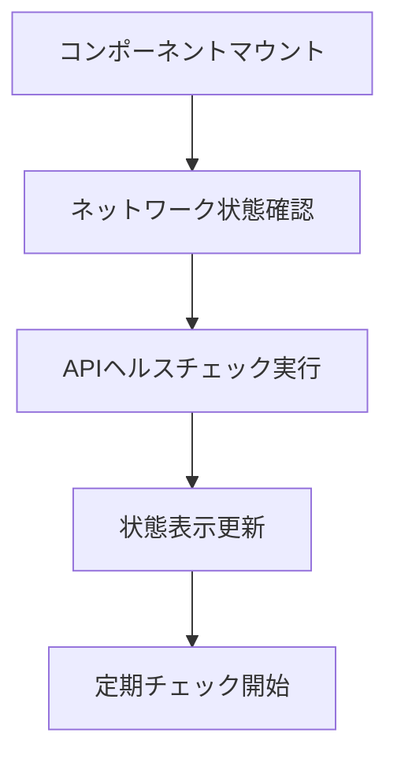
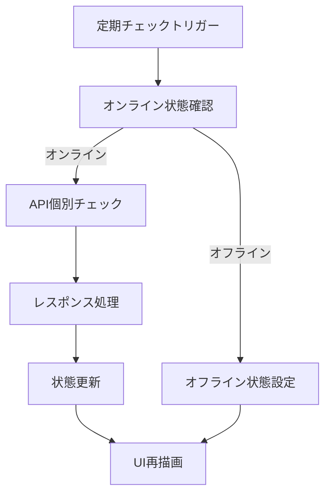
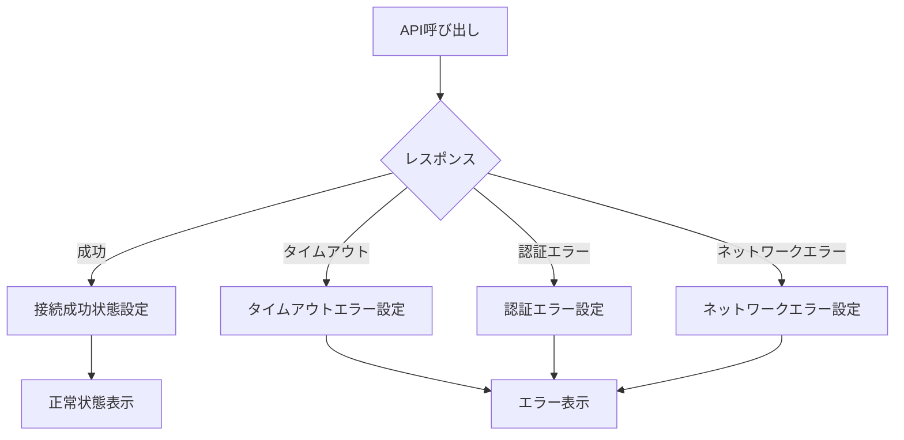

# 接続状態UI仕様書 (Connection Status UI Specification)

## 📋 概要

このドキュメントは、Conea Platformの接続状態表示UIコンポーネントの詳細仕様を定義します。リアルタイムでネットワーク接続とAPI接続状態を監視・表示し、ユーザーに直感的な接続状態情報を提供します。

**作成日**: 2025年5月31日  
**バージョン**: 1.0  
**対象プラットフォーム**: Conea Platform v1.1.0以降

---

## 🎯 目的と要件

### 主要目的
- **リアルタイム監視**: ネットワーク接続とAPI接続状態のリアルタイム監視
- **直感的表示**: 色分けとアイコンによる直感的な接続状態表示
- **詳細情報提供**: 各API個別の接続状態と詳細情報の表示
- **ユーザビリティ向上**: 接続問題の早期発見と対処支援

### 機能要件
1. ネットワーク接続状態の監視（オンライン/オフライン）
2. 複数API接続状態の個別監視
3. 自動・手動リフレッシュ機能
4. 詳細情報パネルの表示/非表示
5. エラー状態の表示と診断情報提供

### 非機能要件
- **レスポンス性**: 接続状態変化から表示更新まで1秒以内
- **可用性**: 99.9%の稼働時間
- **アクセシビリティ**: WCAG 2.1 AA準拠
- **パフォーマンス**: メモリ使用量50MB未満

---

## 🔧 技術仕様

### アーキテクチャ概要

```
Frontend (React)
├── ConnectionStatusIndicator.tsx    # UIコンポーネント
├── useConnectionStatus.ts          # カスタムHook
└── /api/health                     # バックエンドAPI

Backend (Node.js)
├── /api/health                     # 基本ヘルスチェック
├── /api/health/detailed            # 詳細ヘルスチェック
└── /api/health/environment         # 環境変数チェック（開発用）
```

### 対応API一覧

| API名 | 表示名 | 接続確認方法 | エラーハンドリング |
|-------|--------|-------------|------------------|
| Shopify | Shopify | REST API ping | APIキー検証エラー |
| Amazon | Amazon | MWS接続確認 | 認証エラー、レート制限 |
| Rakuten | 楽天 | RMS API ping | APIキー無効、サーバーエラー |
| NextEngine | NextEngine | API接続テスト | 認証失敗、タイムアウト |
| Smaregi | スマレジ | APIヘルスチェック | トークン期限切れ |
| Google Analytics | Google Analytics | Analytics API確認 | OAuth認証エラー |

---

## 🎨 UI/UX仕様

### ビジュアルデザイン

#### 状態色定義
```css
/* 接続状態の色分け */
.status-connected    { background: #10B981; color: #D1FAE5; } /* 緑: 全て接続 */
.status-partial      { background: #F59E0B; color: #FEF3C7; } /* 黄: 一部接続 */
.status-disconnected { background: #EF4444; color: #FEE2E2; } /* 赤: 接続なし */
.status-offline      { background: #6B7280; color: #F3F4F6; } /* 灰: オフライン */
```

#### ドットインジケーター
```css
/* ステータスドット */
.dot-connected    { background: #10B981; } /* 緑ドット */
.dot-partial      { background: #F59E0B; } /* 黄ドット */
.dot-disconnected { background: #EF4444; } /* 赤ドット */
.dot-offline      { background: #6B7280; } /* 灰ドット */
```

### レスポンシブ対応

| デバイス | 表示方式 | 詳細パネル幅 |
|----------|----------|-------------|
| デスクトップ (1200px+) | フル表示 | 320px |
| タブレット (768px-1199px) | 圧縮表示 | 280px |
| モバイル (767px以下) | ミニマル表示 | 画面幅-20px |

### アニメーション仕様

| 要素 | アニメーション | 持続時間 | イージング |
|------|----------------|----------|-----------|
| ステータス変更 | 色変化 | 200ms | ease-in-out |
| 詳細パネル | スライドイン/アウト | 150ms | ease-out |
| 更新アイコン | 回転 | 1000ms | linear |
| ドット点滅 | ローディング | 1500ms | ease-in-out |

---

## 📱 コンポーネント仕様

### ConnectionStatusIndicator コンポーネント

#### Props
```typescript
interface ConnectionStatusIndicatorProps {
  // 表示位置の指定
  position?: 'top-left' | 'top-right' | 'bottom-left' | 'bottom-right';
  // 詳細パネルの初期表示状態
  defaultExpanded?: boolean;
  // 更新間隔の設定（ミリ秒）
  refreshInterval?: number;
  // スタイルのカスタマイズ
  className?: string;
  // テーマの指定
  theme?: 'light' | 'dark' | 'auto';
}
```

#### State管理
```typescript
interface ConnectionStatus {
  isOnline: boolean;                    // ネットワーク接続状態
  apiStatus: APIConnectionStatus;       // API別接続状態
  lastChecked: string | null;           // 最終チェック時刻
  isLoading: boolean;                   // ローディング状態
  error: string | null;                 // エラーメッセージ
}

interface APIConnectionStatus {
  shopify: APIStatus;
  amazon: APIStatus;
  rakuten: APIStatus;
  nextengine: APIStatus;
  smaregi: APIStatus;
  google_analytics: APIStatus;
}

interface APIStatus {
  connected: boolean;                   // 接続状態
  message: string;                      // 状態メッセージ
  lastChecked?: string;                 // 個別チェック時刻
  responseTime?: number;                // レスポンス時間（ms）
  errorCode?: string;                   // エラーコード
}
```

### useConnectionStatus カスタムHook

#### 提供機能
```typescript
interface UseConnectionStatusReturn {
  // 状態値
  isOnline: boolean;
  apiStatus: APIConnectionStatus;
  lastChecked: string | null;
  isLoading: boolean;
  error: string | null;
  
  // 操作関数
  refreshStatus: () => void;            // 手動更新
  getAPIStatus: (apiName: string) => APIStatus; // 個別API状態取得
  getOverallStatus: () => OverallStatus; // 全体状態取得
}

interface OverallStatus {
  status: 'connected' | 'partial' | 'disconnected' | 'offline';
  message: string;
  connectedCount: number;
  totalCount: number;
}
```

---

## 🔄 データフロー仕様

### 初期化フロー


### 更新フロー


### エラーハンドリングフロー


---

## 🛠️ API仕様

### GET /api/health
**基本ヘルスチェックエンドポイント**

#### レスポンス
```json
{
  "status": "ok",
  "timestamp": "2025-05-31T12:00:00.000Z",
  "version": "2.0.0",
  "environment": "production",
  "mode": "integrated",
  "services": {
    "api": "running",
    "database": "file_based",
    "redis": "connected",
    "slack": "configured",
    "socket": "enabled"
  },
  "apis": {
    "shopify": {
      "connected": true,
      "message": "接続正常",
      "responseTime": 150
    },
    "amazon": {
      "connected": false,
      "message": "APIキーが設定されていません",
      "errorCode": "NO_API_KEY"
    },
    "rakuten": {
      "connected": true,
      "message": "接続正常",
      "responseTime": 200
    },
    "nextengine": {
      "connected": false,
      "message": "認証エラー",
      "errorCode": "AUTH_FAILED"
    },
    "smaregi": {
      "connected": true,
      "message": "接続正常",
      "responseTime": 120
    },
    "google_analytics": {
      "connected": true,
      "message": "接続正常",
      "responseTime": 300
    }
  }
}
```

### GET /api/health/detailed
**詳細ヘルスチェックエンドポイント**

#### レスポンス
```json
{
  "status": "ok",
  "timestamp": "2025-05-31T12:00:00.000Z",
  "server": {
    "uptime": 3600000,
    "memory": {
      "used": 45.2,
      "total": 512.0,
      "unit": "MB"
    },
    "cpu": {
      "usage": 15.5,
      "unit": "percent"
    }
  },
  "apis": {
    "shopify": {
      "connected": true,
      "message": "接続正常",
      "responseTime": 150,
      "lastChecked": "2025-05-31T11:59:30.000Z",
      "endpoint": "https://shop.myshopify.com/admin/api/2023-04/shop.json",
      "version": "2023-04"
    }
  }
}
```

---

## 🧪 テスト仕様

### 単体テスト

#### useConnectionStatus Hook
```typescript
describe('useConnectionStatus', () => {
  test('初期状態の確認', () => {
    // navigator.onLineの状態確認
    // 初期API状態の確認
  });
  
  test('APIステータス更新', async () => {
    // fetchのモック設定
    // ステータス更新の確認
  });
  
  test('エラーハンドリング', async () => {
    // ネットワークエラーのシミュレーション
    // エラー状態の確認
  });
  
  test('定期更新機能', () => {
    // setIntervalのモック
    // 定期更新の動作確認
  });
});
```

#### ConnectionStatusIndicator コンポーネント
```typescript
describe('ConnectionStatusIndicator', () => {
  test('状態別表示確認', () => {
    // 各接続状態での表示確認
    // 色分けの確認
  });
  
  test('詳細パネル表示', () => {
    // クリックによる詳細パネル表示
    // API個別状態の表示確認
  });
  
  test('更新ボタン動作', () => {
    // 更新ボタンクリック
    // 更新処理の実行確認
  });
  
  test('レスポンシブ対応', () => {
    // 画面サイズ別表示確認
  });
});
```

### 統合テスト

#### E2Eテスト
```typescript
describe('接続状態UI E2E', () => {
  test('正常接続シナリオ', async () => {
    // 全API正常接続時の表示確認
  });
  
  test('部分接続シナリオ', async () => {
    // 一部API接続エラー時の表示確認
  });
  
  test('オフラインシナリオ', async () => {
    // ネットワーク切断時の動作確認
  });
  
  test('自動更新動作', async () => {
    // 30秒間隔での自動更新確認
  });
});
```

### パフォーマンステスト

#### 負荷テスト
- 同時接続ユーザー数: 1000人
- APIレスポンス時間: 平均200ms以下
- メモリ使用量: 50MB以下
- CPU使用率: 30%以下

---

## 🔒 セキュリティ考慮事項

### データ保護
- APIキーの機密情報は表示しない
- エラーメッセージでの機密情報漏洩防止
- ローカルストレージへの機密データ保存禁止

### 認証・認可
- ヘルスチェックエンドポイントのレート制限
- 詳細情報は認証済みユーザーのみアクセス可能
- 本番環境での環境変数エンドポイント無効化

### 通信セキュリティ
- HTTPS通信の強制
- CORS設定の適切な制限
- CSP（Content Security Policy）の設定

---

## 📈 監視・ログ仕様

### ログ出力

#### 接続状態変更ログ
```javascript
log(`接続状態変更: ${apiName} ${oldStatus} -> ${newStatus}`, 'INFO');
```

#### エラーログ
```javascript
log(`API接続エラー: ${apiName} - ${errorMessage}`, 'ERROR');
```

#### パフォーマンスログ
```javascript
log(`API応答時間: ${apiName} - ${responseTime}ms`, 'PERFORMANCE');
```

### メトリクス収集

| メトリクス名 | 説明 | 閾値 |
|-------------|------|------|
| api_response_time | API応答時間 | 500ms |
| connection_failure_rate | 接続失敗率 | 5% |
| ui_render_time | UI描画時間 | 100ms |
| memory_usage | メモリ使用量 | 50MB |

---

## 🔧 設定・カスタマイズ

### 環境変数設定

```bash
# APIキー設定
SHOPIFY_API_KEY=your_shopify_key
AMAZON_ACCESS_KEY=your_amazon_key
RAKUTEN_API_KEY=your_rakuten_key
NEXTENGINE_API_KEY=your_nextengine_key
SMAREGI_API_KEY=your_smaregi_key
GOOGLE_ANALYTICS_CLIENT_ID=your_ga_client_id

# 接続タイムアウト設定
API_TIMEOUT=5000

# 更新間隔設定（ミリ秒）
CONNECTION_CHECK_INTERVAL=30000

# ログレベル設定
LOG_LEVEL=INFO
```

### テーマカスタマイズ

```css
/* ダークテーマ */
.connection-status.dark {
  --status-connected: #059669;
  --status-partial: #D97706;
  --status-disconnected: #DC2626;
  --status-offline: #4B5563;
  --background: #1F2937;
  --text: #F9FAFB;
}

/* ライトテーマ */
.connection-status.light {
  --status-connected: #10B981;
  --status-partial: #F59E0B;
  --status-disconnected: #EF4444;
  --status-offline: #6B7280;
  --background: #FFFFFF;
  --text: #111827;
}
```

---

## 📚 使用方法

### 基本実装

```tsx
import { ConnectionStatusIndicator } from '@/components/common';

function Dashboard() {
  return (
    <div className="dashboard">
      <header className="dashboard-header">
        <h1>Conea Dashboard</h1>
        <ConnectionStatusIndicator 
          position="top-right"
          refreshInterval={30000}
          theme="auto"
        />
      </header>
      {/* ダッシュボードコンテンツ */}
    </div>
  );
}
```

### カスタマイズ例

```tsx
import { useConnectionStatus } from '@/hooks/useConnectionStatus';

function CustomStatusDisplay() {
  const { isOnline, apiStatus, getOverallStatus } = useConnectionStatus();
  const overall = getOverallStatus();
  
  return (
    <div className="custom-status">
      <div className={`status-badge ${overall.status}`}>
        {overall.message}
      </div>
      
      <div className="api-grid">
        {Object.entries(apiStatus).map(([api, status]) => (
          <div key={api} className={`api-card ${status.connected ? 'connected' : 'disconnected'}`}>
            <span className="api-name">{api}</span>
            <span className="api-status">{status.message}</span>
          </div>
        ))}
      </div>
    </div>
  );
}
```

---

## 🐛 トラブルシューティング

### よくある問題と解決方法

#### 1. 接続状態が更新されない
**症状**: UIに古い接続状態が表示される
**原因**: ネットワークエラーまたはAPIレスポンス遅延
**解決方法**:
```javascript
// 手動リフレッシュの実行
const { refreshStatus } = useConnectionStatus();
refreshStatus();
```

#### 2. APIキーエラーが解消されない
**症状**: 正しいAPIキーを設定してもエラーが継続
**原因**: 環境変数の再読み込みが必要
**解決方法**:
```bash
# サーバー再起動
npm restart

# または環境変数の再読み込み
source .env
```

#### 3. 詳細パネルが表示されない
**症状**: クリックしても詳細パネルが開かない
**原因**: JavaScriptエラーまたはCSSスタイル競合
**解決方法**:
- ブラウザコンソールでエラー確認
- z-indexの調整
- CSSリセットの確認

### デバッグ方法

#### コンソールログの有効化
```javascript
// 開発環境でのデバッグ出力
if (process.env.NODE_ENV === 'development') {
  console.log('Connection Status Debug:', connectionStatus);
}
```

#### ネットワークタブでのAPI確認
1. ブラウザ開発者ツールを開く
2. Networkタブを選択
3. `/api/health`エンドポイントの通信確認
4. レスポンス内容とステータスコードを確認

---

## 📋 チェックリスト

### 実装完了チェック

- [x] `useConnectionStatus` カスタムHook実装
- [x] `ConnectionStatusIndicator` コンポーネント実装  
- [x] `/api/health` エンドポイント実装
- [x] 状態色分け実装
- [x] 詳細パネル実装
- [x] 自動更新機能実装
- [x] エラーハンドリング実装
- [x] レスポンシブ対応実装

### テスト完了チェック

- [ ] 単体テスト実装
- [ ] 統合テスト実装
- [ ] E2Eテスト実装
- [ ] パフォーマンステスト実行
- [ ] セキュリティテスト実行
- [ ] アクセシビリティテスト実行

### デプロイ準備チェック

- [ ] 本番環境設定確認
- [ ] 環境変数設定確認
- [ ] 監視設定完了
- [ ] ログ出力設定完了
- [ ] ドキュメント更新完了

---

## 📝 更新履歴

| バージョン | 日付 | 変更内容 | 担当者 |
|-----------|------|----------|--------|
| 1.0 | 2025-05-31 | 初版作成 | Claude Code |

---

## 📞 サポート・問い合わせ

### 技術的な問題
- GitHub Issues: [conea-integration/issues](https://github.com/gentacupoftea/conea-integration/issues)
- 開発者Slack: #conea-dev-support

### 仕様に関する質問
- プロダクトチーム: product@conea.ai
- 技術ドキュメント: [docs.conea.ai](https://docs.conea.ai)

---

**© 2025 Conea Platform. All rights reserved.**