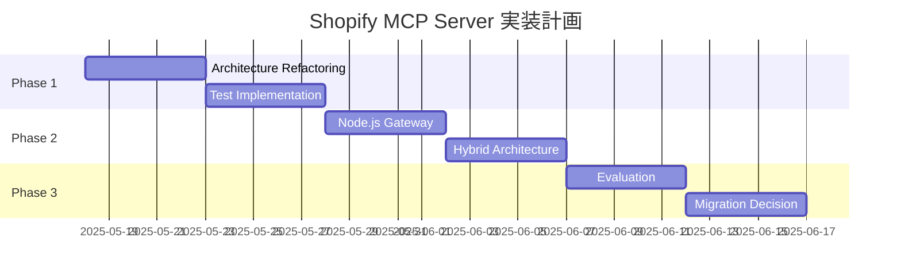

# Shopify MCP Server - 実装計画書

## 概要
Pythonベースの現行実装を改善し、段階的にNode.jsへ移行する計画

## フェーズ1: Python改善（Week 1-2）

### Week 1: アーキテクチャリファクタリング

#### Day 1-2: プロジェクト構造の再編成
```bash
shopify-mcp-server/
├── src/
│   ├── __init__.py
│   ├── server.py              # MCPサーバーのエントリーポイント
│   ├── api/
│   │   ├── __init__.py
│   │   └── shopify_client.py  # Shopify APIクライアント
│   ├── services/
│   │   ├── __init__.py
│   │   ├── analytics.py       # データ分析サービス
│   │   └── visualization.py   # グラフ生成サービス
│   ├── utils/
│   │   ├── __init__.py
│   │   ├── config.py          # 設定管理
│   │   ├── errors.py          # エラーハンドリング
│   │   └── logger.py          # ログ設定
│   └── models/
│       ├── __init__.py
│       └── schemas.py         # データモデル定義
├── tests/
│   ├── unit/
│   ├── integration/
│   └── fixtures/
├── config/
│   ├── default.yaml
│   ├── development.yaml
│   └── production.yaml
└── requirements/
    ├── base.txt
    ├── dev.txt
    └── prod.txt
```

#### Day 3-4: コア機能の実装
- エラーハンドリングシステム
- 設定管理（pydantic使用）
- ログシステム（structlog）

#### Day 5: テスト基盤の構築
- pytest設定
- テストフィクスチャ
- モックとスタブの準備

### Week 2: 品質向上とドキュメント

#### Day 6-7: テスト実装
- ユニットテスト（coverage 80%以上）
- 統合テスト
- E2Eテスト

#### Day 8-9: CI/CD設定
- GitHub Actions設定
- 自動テスト
- コード品質チェック（flake8, black, mypy）

#### Day 10: ドキュメント作成
- API仕様書更新
- デプロイメントガイド
- 開発者向けドキュメント

## フェーズ2: ハイブリッドアーキテクチャ（Week 3-4）

### Week 3: Node.js Gateway実装

#### アーキテクチャ
```
┌────────────────┐     ┌──────────────────┐     ┌─────────────────┐
│ Claude Desktop │────►│ Node.js Gateway  │────►│ Python MCP      │
│                │     │ (Express/Fastify)│     │ Server          │
└────────────────┘     └──────────────────┘     └─────────────────┘
                               │                        │
                               ▼                        ▼
                       ┌──────────────────┐    ┌─────────────────┐
                       │ Authentication   │    │ Shopify API     │
                       │ & Rate Limiting  │    │ Data Processing │
                       └──────────────────┘    └─────────────────┘
```

#### 実装項目
1. Express/Fastifyサーバー
2. MCPクライアント接続
3. ルーティングとミドルウェア
4. エラーハンドリング
5. ロギング（Winston/Pino）

### Week 4: 機能の段階的移行

#### 優先順位
1. 認証とセキュリティ → Node.js
2. APIルーティング → Node.js
3. データ処理 → Python（当面維持）
4. 新機能 → Node.jsで実装

## フェーズ3: 完全移行評価（Week 5-6）

### 評価基準
1. パフォーマンス比較
2. 開発効率の評価
3. 運用コストの分析
4. チームスキルセットの考慮

### 移行オプション
- Option A: 完全Node.js移行
- Option B: ハイブリッド維持
- Option C: Python継続 + アーキテクチャ改善

## タイムライン



## リスクと対策

### リスク
1. **既存機能の破壊**
   - 対策: 包括的なテストスイート
   - 対策: 段階的リリース

2. **パフォーマンス劣化**
   - 対策: ベンチマークテスト
   - 対策: プロファイリング

3. **運用複雑性の増加**
   - 対策: 自動化の強化
   - 対策: 監視システムの構築

## 成功指標

1. **技術的指標**
   - テストカバレッジ 80%以上
   - レスポンスタイム 200ms以下
   - エラー率 0.1%以下

2. **開発効率指標**
   - デプロイ時間 50%削減
   - バグ修正時間 30%削減
   - 機能追加速度 2倍

3. **運用指標**
   - ダウンタイム 99.9%以上
   - インシデント対応時間 1時間以内

## 結論

3段階のアプローチにより、リスクを最小化しながら、より保守性と拡張性の高いアーキテクチャへの移行を実現します。各フェーズの完了時に評価を行い、次のステップを決定する柔軟なアプローチを採用します。