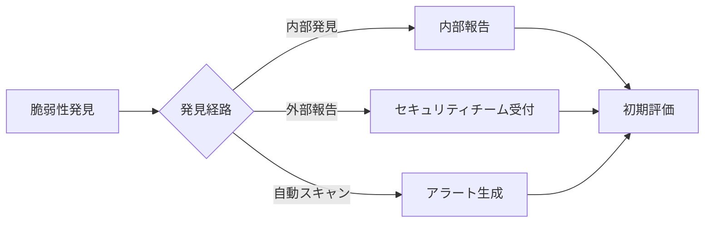
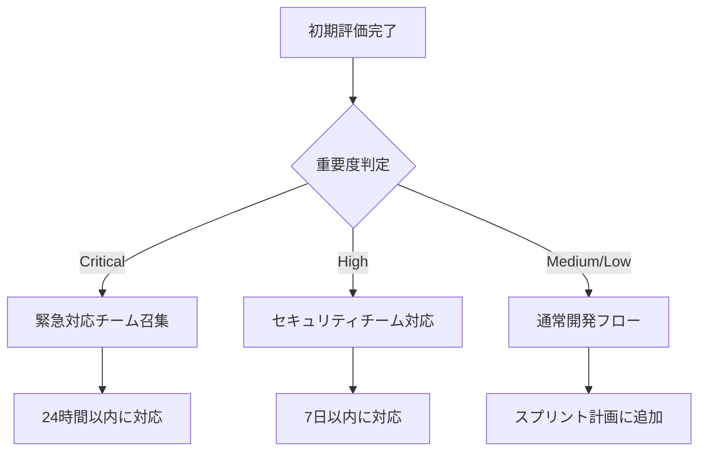

# 脆弱性対応プロセス

## 概要

このドキュメントは、Shopify MCP Serverにおける脆弱性の発見から修正、公開までの標準的な対応プロセスを定義します。

## 1. 脆弱性の分類

### 重要度レベル

| レベル | 説明 | CVSS v3.1 スコア | 対応時間 |
|--------|------|-----------------|----------|
| Critical | システム全体に影響を与える重大な脆弱性 | 9.0 - 10.0 | 24時間以内 |
| High | 重要な機能に影響を与える脆弱性 | 7.0 - 8.9 | 7日以内 |
| Medium | 限定的な影響を持つ脆弱性 | 4.0 - 6.9 | 30日以内 |
| Low | 最小限の影響を持つ脆弱性 | 0.1 - 3.9 | 90日以内 |

### 影響カテゴリ

- **データ漏洩**: 機密情報の不正アクセスまたは露出
- **認証バイパス**: 認証メカニズムの回避
- **権限昇格**: 不正な権限の取得
- **サービス拒否**: システムの可用性への影響
- **コード実行**: 任意のコード実行の可能性

## 2. 脆弱性対応フロー

### フェーズ1: 発見と報告



**アクション項目:**

1. **脆弱性の記録**
   - 発見日時
   - 発見者情報
   - 脆弱性の詳細
   - 再現手順
   - 影響範囲

2. **初期評価**
   - CVSSスコアの算出
   - 重要度レベルの決定
   - 影響を受けるコンポーネントの特定

### フェーズ2: トリアージと優先順位付け



**チェックリスト:**

- [ ] CVSSスコアの検証
- [ ] ビジネスへの影響評価
- [ ] 対応リソースの確保
- [ ] ステークホルダーへの通知

### フェーズ3: 修正開発

**開発プロセス:**

1. **根本原因分析**
   ```
   - 脆弱性の技術的原因
   - 影響を受けるコードの特定
   - 関連する依存関係の調査
   ```

2. **修正方針の策定**
   ```
   - パッチ開発計画
   - 回避策の検討
   - テスト計画の作成
   ```

3. **実装とレビュー**
   ```
   - セキュアコーディング規約の遵守
   - ピアレビューの実施
   - セキュリティレビューの実施
   ```

### フェーズ4: テストと検証

**テスト項目:**

1. **セキュリティテスト**
   - [ ] 脆弱性の修正確認
   - [ ] 回帰テストの実施
   - [ ] ペネトレーションテスト
   - [ ] 自動脆弱性スキャン

2. **機能テスト**
   - [ ] 影響を受ける機能の動作確認
   - [ ] 統合テストの実施
   - [ ] パフォーマンステスト

3. **互換性テスト**
   - [ ] 後方互換性の確認
   - [ ] APIバージョニングの確認

### フェーズ5: デプロイとリリース

**リリースプロセス:**

1. **段階的展開**
   ```
   開発環境 → ステージング環境 → 本番環境
   ```

2. **モニタリング**
   - エラー率の監視
   - パフォーマンスメトリクス
   - セキュリティアラート

3. **ロールバック計画**
   - 問題発生時の即座のロールバック
   - データバックアップの確認

### フェーズ6: 開示と文書化

**開示タイムライン:**

| 状況 | 開示時期 |
|-----|---------|
| Critical（外部攻撃可能） | パッチ適用後即座 |
| High（認証必要） | パッチ適用後7日以内 |
| Medium/Low | 月次セキュリティレポート |

**開示内容:**

1. **セキュリティアドバイザリ**
   ```markdown
   # セキュリティアドバイザリ SMCP-2024-001
   
   **タイトル**: [脆弱性の簡潔な説明]
   **重要度**: Critical/High/Medium/Low
   **CVSSスコア**: X.X
   **影響バージョン**: vX.X.X - vY.Y.Y
   **修正バージョン**: vZ.Z.Z
   
   ## 概要
   [脆弱性の説明]
   
   ## 影響
   [ビジネスへの影響]
   
   ## 対策
   [推奨される対策]
   
   ## 謝辞
   [発見者への謝辞（許可がある場合）]
   ```

2. **変更履歴**
   - CHANGELOG.mdの更新
   - リリースノートの作成

3. **ナレッジベース**
   - 内部文書の更新
   - 教訓の記録

## 3. 役割と責任

### セキュリティチーム

- 脆弱性の初期評価
- 修正方針の策定
- セキュリティテストの実施
- アドバイザリの作成

### 開発チーム

- 根本原因の分析
- パッチの開発
- 単体テストの実施
- コードレビュー

### DevOpsチーム

- デプロイメントの実施
- モニタリングの設定
- ロールバック対応
- インフラ設定の更新

### プロダクトチーム

- ビジネス影響の評価
- ステークホルダーへの連絡
- リリース計画の承認
- 顧客コミュニケーション

## 4. エスカレーション手順

### レベル1: チームリード
- 初期対応の指揮
- リソース配分の決定

### レベル2: セキュリティマネージャー
- Critical/High脆弱性の対応統括
- 外部への開示判断

### レベル3: CTO/CISO
- 重大インシデントの最終判断
- 法的/規制対応の決定

## 5. コミュニケーション

### 内部コミュニケーション

**Slackチャンネル:**
- `#security-incidents`: インシデント対応
- `#security-updates`: 一般的なアップデート

**定例会議:**
- 週次セキュリティレビュー
- 月次脆弱性レポート

### 外部コミュニケーション

**チャンネル:**
- セキュリティアドバイザリページ
- メーリングリスト
- ソーシャルメディア（重大な場合）

**テンプレート:**
```
件名: [Shopify MCP Server] セキュリティアップデート - [日付]

お客様各位、

Shopify MCP Serverにおいて、[重要度]の脆弱性を修正しました。

影響バージョン: [バージョン]
修正バージョン: [バージョン]

詳細: [リンク]

速やかなアップデートをお願いいたします。

Shopify MCP セキュリティチーム
```

## 6. メトリクスとKPI

### 追跡指標

1. **平均修正時間 (MTTR)**
   - Critical: 24時間以内
   - High: 7日以内
   - Medium: 30日以内

2. **脆弱性発見率**
   - 内部発見 vs 外部報告
   - 自動検出 vs 手動検出

3. **パッチ適用率**
   - リリース後30日以内の適用率

### 月次レポート

```markdown
# セキュリティメトリクス - [年月]

## サマリー
- 新規脆弱性: X件
- 修正完了: Y件
- 平均修正時間: Z日

## 詳細
[各脆弱性の詳細]

## 改善提案
[プロセス改善の提案]
```

## 7. 継続的改善

### 四半期レビュー

1. **プロセスレビュー**
   - 対応時間の分析
   - ボトルネックの特定
   - 改善案の策定

2. **ツールの評価**
   - 脆弱性スキャナーの効果
   - 自動化ツールの導入検討

3. **トレーニング**
   - セキュリティ意識向上研修
   - 新しい脅威への対応訓練

### 年次監査

- プロセス全体の監査
- 外部セキュリティ専門家によるレビュー
- ベストプラクティスとの比較

## 8. 連絡先

### 脆弱性報告

**メール**: security@shopify-mcp-server.com
**PGP公開鍵**: [リンク]

### 緊急連絡先

**24時間ホットライン**: +1-XXX-XXX-XXXX
**オンコール**: [PagerDutyリンク]

---

**最終更新日**: 2024年1月
**承認者**: CTO, CISO
**次回レビュー**: 2024年7月