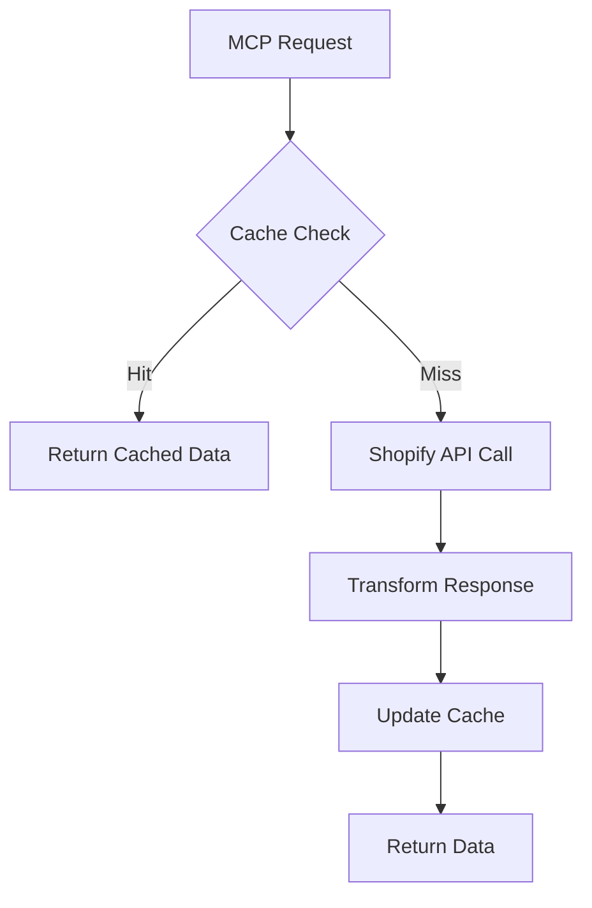

# Data Schema Documentation

## Overview
This document defines the data structures, cache schemas, and data flow patterns used in the Shopify MCP Server.

## Core Data Models

### Product Schema
```python
class Product(BaseModel):
    id: int
    title: str
    body_html: Optional[str]
    vendor: str
    product_type: str
    created_at: datetime
    updated_at: datetime
    published_at: Optional[datetime]
    tags: List[str]
    status: str
    variants: List['Variant']
    images: List['ProductImage']
    options: List['ProductOption']
    
    class Config:
        json_encoders = {
            datetime: lambda v: v.isoformat()
        }
```

### Variant Schema
```python
class Variant(BaseModel):
    id: int
    product_id: int
    title: str
    price: Decimal
    sku: Optional[str]
    position: int
    inventory_policy: str
    compare_at_price: Optional[Decimal]
    fulfillment_service: str
    inventory_management: Optional[str]
    option1: Optional[str]
    option2: Optional[str]
    option3: Optional[str]
    created_at: datetime
    updated_at: datetime
    taxable: bool
    barcode: Optional[str]
    grams: int
    image_id: Optional[int]
    weight: float
    weight_unit: str
    inventory_quantity: int
    old_inventory_quantity: int
    requires_shipping: bool
```

### Order Schema
```python
class Order(BaseModel):
    id: int
    email: str
    closed_at: Optional[datetime]
    created_at: datetime
    updated_at: datetime
    number: int
    note: Optional[str]
    token: str
    gateway: str
    test: bool
    total_price: Decimal
    subtotal_price: Decimal
    total_weight: int
    total_tax: Decimal
    taxes_included: bool
    currency: str
    financial_status: str
    confirmed: bool
    total_discounts: Decimal
    total_line_items_price: Decimal
    cart_token: Optional[str]
    buyer_accepts_marketing: bool
    name: str
    referring_site: Optional[str]
    landing_site: Optional[str]
    cancelled_at: Optional[datetime]
    cancel_reason: Optional[str]
    total_price_usd: Decimal
    checkout_id: Optional[int]
    checkout_token: Optional[str]
    reference: Optional[str]
    user_id: Optional[int]
    location_id: Optional[int]
    source_identifier: Optional[str]
    source_url: Optional[str]
    processed_at: datetime
    device_id: Optional[int]
    phone: Optional[str]
    customer_locale: Optional[str]
    app_id: Optional[int]
    browser_ip: Optional[str]
    landing_site_ref: Optional[str]
    order_number: int
    discount_codes: List['DiscountCode']
    note_attributes: List['NoteAttribute']
    payment_gateway_names: List[str]
    processing_method: str
    source_name: str
    fulfillment_status: Optional[str]
    tax_lines: List['TaxLine']
    tags: str
    contact_email: str
    order_status_url: str
    line_items: List['LineItem']
    shipping_lines: List['ShippingLine']
    fulfillments: List['Fulfillment']
    refunds: List['Refund']
    customer: 'Customer'
```

### Customer Schema
```python
class Customer(BaseModel):
    id: int
    email: str
    accepts_marketing: bool
    created_at: datetime
    updated_at: datetime
    first_name: str
    last_name: str
    orders_count: int
    state: str
    total_spent: Decimal
    last_order_id: Optional[int]
    note: Optional[str]
    verified_email: bool
    multipass_identifier: Optional[str]
    tax_exempt: bool
    phone: Optional[str]
    tags: str
    last_order_name: Optional[str]
    currency: str
    addresses: List['Address']
    default_address: Optional['Address']
```

## Cache Schema

### Redis Cache Structure
```python
CACHE_KEYS = {
    "products": "shopify:products:{shop_id}:{page}",
    "product_detail": "shopify:product:{shop_id}:{product_id}",
    "orders": "shopify:orders:{shop_id}:{page}",
    "order_detail": "shopify:order:{shop_id}:{order_id}",
    "customers": "shopify:customers:{shop_id}:{page}",
    "customer_detail": "shopify:customer:{shop_id}:{customer_id}",
    "inventory": "shopify:inventory:{shop_id}:{location_id}"
}

CACHE_TTL = {
    "products": 300,  # 5 minutes
    "product_detail": 600,  # 10 minutes
    "orders": 60,  # 1 minute
    "order_detail": 300,  # 5 minutes
    "customers": 600,  # 10 minutes
    "customer_detail": 900,  # 15 minutes
    "inventory": 120  # 2 minutes
}
```

### Cache Entry Structure
```python
class CacheEntry(BaseModel):
    key: str
    data: Any
    created_at: datetime
    expires_at: datetime
    hit_count: int = 0
    last_accessed: datetime
    
    def is_expired(self) -> bool:
        return datetime.now() > self.expires_at
    
    def increment_hit(self):
        self.hit_count += 1
        self.last_accessed = datetime.now()
```

## Data Flow Patterns

### Request Flow


### Webhook Processing
```python
class WebhookPayload(BaseModel):
    topic: str
    shop_domain: str
    body: dict
    headers: dict
    
    def validate_hmac(self, secret: str) -> bool:
        # HMAC validation logic
        pass
```

### Batch Processing
```python
class BatchOperation(BaseModel):
    id: str
    status: str
    created_at: datetime
    completed_at: Optional[datetime]
    object_count: int
    root_object_count: int
    url: Optional[str]
    error_code: Optional[str]
    
    def is_complete(self) -> bool:
        return self.status == 'completed'
```

## Database Schema (SQLite)

### Local Cache Database
```sql
CREATE TABLE cache_entries (
    id INTEGER PRIMARY KEY AUTOINCREMENT,
    key TEXT UNIQUE NOT NULL,
    value TEXT NOT NULL,
    created_at TIMESTAMP NOT NULL,
    expires_at TIMESTAMP NOT NULL,
    hit_count INTEGER DEFAULT 0,
    last_accessed TIMESTAMP NOT NULL
);

CREATE INDEX idx_cache_key ON cache_entries(key);
CREATE INDEX idx_cache_expires ON cache_entries(expires_at);
```

### Sync Status Tracking
```sql
CREATE TABLE sync_status (
    id INTEGER PRIMARY KEY AUTOINCREMENT,
    resource_type TEXT NOT NULL,
    last_sync TIMESTAMP NOT NULL,
    next_sync TIMESTAMP NOT NULL,
    status TEXT NOT NULL,
    error_message TEXT,
    record_count INTEGER DEFAULT 0
);
```

### Webhook Events
```sql
CREATE TABLE webhook_events (
    id INTEGER PRIMARY KEY AUTOINCREMENT,
    topic TEXT NOT NULL,
    shop_domain TEXT NOT NULL,
    received_at TIMESTAMP NOT NULL,
    processed_at TIMESTAMP,
    status TEXT NOT NULL,
    payload TEXT NOT NULL,
    error_message TEXT
);
```

## GraphQL Schema Types

### Product Type
```graphql
type Product {
  id: ID!
  title: String!
  description: String
  vendor: String!
  productType: String!
  createdAt: DateTime!
  updatedAt: DateTime!
  publishedAt: DateTime
  tags: [String!]!
  status: ProductStatus!
  variants(first: Int, after: String): VariantConnection!
  images(first: Int, after: String): ImageConnection!
  options: [ProductOption!]!
}
```

### Order Type
```graphql
type Order {
  id: ID!
  name: String!
  email: String!
  createdAt: DateTime!
  updatedAt: DateTime!
  financialStatus: OrderFinancialStatus!
  fulfillmentStatus: OrderFulfillmentStatus!
  totalPrice: Money!
  subtotalPrice: Money!
  totalTax: Money!
  currencyCode: CurrencyCode!
  lineItems(first: Int, after: String): LineItemConnection!
  customer: Customer
  shippingAddress: MailingAddress
  billingAddress: MailingAddress
}
```

## Performance Metrics Schema

### API Metrics
```python
class APIMetric(BaseModel):
    endpoint: str
    method: str
    response_time: float
    status_code: int
    timestamp: datetime
    error: Optional[str]
    
    @property
    def is_error(self) -> bool:
        return self.status_code >= 400
```

### Cache Performance
```python
class CacheMetric(BaseModel):
    operation: str  # get, set, delete
    key_pattern: str
    hit_rate: float
    response_time: float
    size_bytes: int
    timestamp: datetime
```

## Data Validation Rules

### Product Validation
```python
PRODUCT_VALIDATION = {
    "title": {"required": True, "min_length": 1, "max_length": 255},
    "vendor": {"required": True, "min_length": 1, "max_length": 255},
    "product_type": {"required": True, "min_length": 1, "max_length": 255},
    "status": {"required": True, "values": ["active", "archived", "draft"]},
    "variants": {"required": True, "min_items": 1}
}
```

### Order Validation
```python
ORDER_VALIDATION = {
    "email": {"required": True, "format": "email"},
    "line_items": {"required": True, "min_items": 1},
    "financial_status": {
        "required": True,
        "values": ["pending", "authorized", "paid", "partially_paid", "refunded", "voided"]
    },
    "fulfillment_status": {
        "required": False,
        "values": ["fulfilled", "partial", "restocked", None]
    }
}
```

## Data Migration Schema

### Version Control
```python
class DataMigration(BaseModel):
    version: str
    description: str
    created_at: datetime
    applied_at: Optional[datetime]
    rollback_at: Optional[datetime]
    status: str  # pending, applied, rolled_back
    
    def apply(self):
        # Migration logic
        pass
    
    def rollback(self):
        # Rollback logic
        pass
```

Generated by: エンジニア (OdenCraft)
Date: 2025-5-17