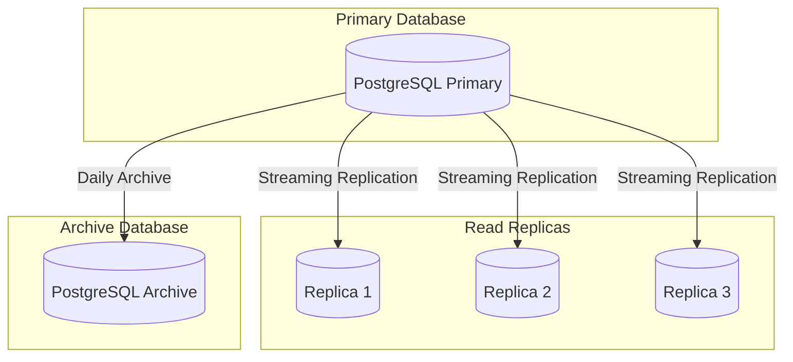

# Conea Integration Platform - データベーススキーマ設計

## 目次

1. [概要](#概要)
2. [データベース構成](#データベース構成)
3. [テーブル設計](#テーブル設計)
4. [インデックス戦略](#インデックス戦略)
5. [パーティショニング](#パーティショニング)
6. [マイグレーション](#マイグレーション)

## 概要

Conea Integration Platformは、PostgreSQLをメインデータベースとして使用し、高可用性とスケーラビリティを実現するための設計を採用しています。

### 設計原則

1. **正規化**: 第3正規形を基本とし、パフォーマンスが必要な箇所は適切に非正規化
2. **拡張性**: JSONB型を活用した柔軟なスキーマ設計
3. **監査性**: すべての重要テーブルに監査フィールドを設置
4. **パフォーマンス**: 適切なインデックスとパーティショニング
5. **整合性**: 外部キー制約とトリガーによるデータ整合性の保証

## データベース構成



## テーブル設計

### ユーザー管理

#### users テーブル
```sql
CREATE TABLE users (
    id UUID PRIMARY KEY DEFAULT gen_random_uuid(),
    email VARCHAR(255) UNIQUE NOT NULL,
    email_verified BOOLEAN DEFAULT FALSE,
    password_hash VARCHAR(255) NOT NULL,
    name VARCHAR(255),
    avatar_url VARCHAR(500),
    role VARCHAR(50) NOT NULL DEFAULT 'user',
    status VARCHAR(50) NOT NULL DEFAULT 'active',
    last_login_at TIMESTAMP WITH TIME ZONE,
    failed_login_attempts INTEGER DEFAULT 0,
    locked_until TIMESTAMP WITH TIME ZONE,
    metadata JSONB DEFAULT '{}',
    created_at TIMESTAMP WITH TIME ZONE DEFAULT CURRENT_TIMESTAMP,
    updated_at TIMESTAMP WITH TIME ZONE DEFAULT CURRENT_TIMESTAMP,
    deleted_at TIMESTAMP WITH TIME ZONE,
    CONSTRAINT check_role CHECK (role IN ('admin', 'user', 'viewer')),
    CONSTRAINT check_status CHECK (status IN ('active', 'inactive', 'suspended', 'deleted'))
);

CREATE INDEX idx_users_email ON users(email) WHERE deleted_at IS NULL;
CREATE INDEX idx_users_status ON users(status) WHERE deleted_at IS NULL;
CREATE INDEX idx_users_metadata ON users USING gin(metadata);
```

#### user_sessions テーブル
```sql
CREATE TABLE user_sessions (
    id UUID PRIMARY KEY DEFAULT gen_random_uuid(),
    user_id UUID NOT NULL REFERENCES users(id) ON DELETE CASCADE,
    token_hash VARCHAR(255) UNIQUE NOT NULL,
    device_info JSONB,
    ip_address INET,
    expires_at TIMESTAMP WITH TIME ZONE NOT NULL,
    revoked_at TIMESTAMP WITH TIME ZONE,
    created_at TIMESTAMP WITH TIME ZONE DEFAULT CURRENT_TIMESTAMP,
    CONSTRAINT check_expiry CHECK (expires_at > created_at)
);

CREATE INDEX idx_sessions_user_id ON user_sessions(user_id) WHERE revoked_at IS NULL;
CREATE INDEX idx_sessions_token ON user_sessions(token_hash) WHERE revoked_at IS NULL;
CREATE INDEX idx_sessions_expires ON user_sessions(expires_at) WHERE revoked_at IS NULL;
```

### 組織管理

#### organizations テーブル
```sql
CREATE TABLE organizations (
    id UUID PRIMARY KEY DEFAULT gen_random_uuid(),
    name VARCHAR(255) NOT NULL,
    slug VARCHAR(255) UNIQUE NOT NULL,
    description TEXT,
    logo_url VARCHAR(500),
    website VARCHAR(500),
    industry VARCHAR(100),
    size VARCHAR(50),
    settings JSONB DEFAULT '{}',
    subscription_tier VARCHAR(50) DEFAULT 'free',
    subscription_expires_at TIMESTAMP WITH TIME ZONE,
    created_at TIMESTAMP WITH TIME ZONE DEFAULT CURRENT_TIMESTAMP,
    updated_at TIMESTAMP WITH TIME ZONE DEFAULT CURRENT_TIMESTAMP,
    deleted_at TIMESTAMP WITH TIME ZONE,
    CONSTRAINT check_subscription_tier CHECK (subscription_tier IN ('free', 'basic', 'pro', 'enterprise'))
);

CREATE INDEX idx_orgs_slug ON organizations(slug) WHERE deleted_at IS NULL;
CREATE INDEX idx_orgs_subscription ON organizations(subscription_tier, subscription_expires_at) WHERE deleted_at IS NULL;
```

#### organization_members テーブル
```sql
CREATE TABLE organization_members (
    id UUID PRIMARY KEY DEFAULT gen_random_uuid(),
    organization_id UUID NOT NULL REFERENCES organizations(id) ON DELETE CASCADE,
    user_id UUID NOT NULL REFERENCES users(id) ON DELETE CASCADE,
    role VARCHAR(50) NOT NULL DEFAULT 'member',
    permissions JSONB DEFAULT '[]',
    invited_by UUID REFERENCES users(id),
    joined_at TIMESTAMP WITH TIME ZONE DEFAULT CURRENT_TIMESTAMP,
    updated_at TIMESTAMP WITH TIME ZONE DEFAULT CURRENT_TIMESTAMP,
    UNIQUE(organization_id, user_id),
    CONSTRAINT check_member_role CHECK (role IN ('owner', 'admin', 'member', 'viewer'))
);

CREATE INDEX idx_org_members_org ON organization_members(organization_id);
CREATE INDEX idx_org_members_user ON organization_members(user_id);
```

### AI統合

#### ai_models テーブル
```sql
CREATE TABLE ai_models (
    id UUID PRIMARY KEY DEFAULT gen_random_uuid(),
    provider VARCHAR(50) NOT NULL,
    model_name VARCHAR(100) NOT NULL,
    model_version VARCHAR(50),
    capabilities JSONB DEFAULT '[]',
    max_tokens INTEGER,
    pricing JSONB,
    status VARCHAR(50) DEFAULT 'active',
    metadata JSONB DEFAULT '{}',
    created_at TIMESTAMP WITH TIME ZONE DEFAULT CURRENT_TIMESTAMP,
    updated_at TIMESTAMP WITH TIME ZONE DEFAULT CURRENT_TIMESTAMP,
    UNIQUE(provider, model_name, model_version),
    CONSTRAINT check_provider CHECK (provider IN ('openai', 'anthropic', 'google', 'cohere', 'custom'))
);

CREATE INDEX idx_ai_models_provider ON ai_models(provider) WHERE status = 'active';
CREATE INDEX idx_ai_models_capabilities ON ai_models USING gin(capabilities);
```

#### ai_conversations テーブル
```sql
CREATE TABLE ai_conversations (
    id UUID PRIMARY KEY DEFAULT gen_random_uuid(),
    organization_id UUID NOT NULL REFERENCES organizations(id) ON DELETE CASCADE,
    user_id UUID NOT NULL REFERENCES users(id),
    model_id UUID NOT NULL REFERENCES ai_models(id),
    title VARCHAR(500),
    context JSONB DEFAULT '{}',
    total_tokens INTEGER DEFAULT 0,
    cost DECIMAL(10, 4) DEFAULT 0,
    created_at TIMESTAMP WITH TIME ZONE DEFAULT CURRENT_TIMESTAMP,
    updated_at TIMESTAMP WITH TIME ZONE DEFAULT CURRENT_TIMESTAMP,
    completed_at TIMESTAMP WITH TIME ZONE
);

CREATE INDEX idx_conversations_org ON ai_conversations(organization_id);
CREATE INDEX idx_conversations_user ON ai_conversations(user_id);
CREATE INDEX idx_conversations_created ON ai_conversations(created_at DESC);
```

#### ai_messages テーブル
```sql
CREATE TABLE ai_messages (
    id UUID PRIMARY KEY DEFAULT gen_random_uuid(),
    conversation_id UUID NOT NULL REFERENCES ai_conversations(id) ON DELETE CASCADE,
    role VARCHAR(50) NOT NULL,
    content TEXT NOT NULL,
    tokens INTEGER,
    metadata JSONB DEFAULT '{}',
    created_at TIMESTAMP WITH TIME ZONE DEFAULT CURRENT_TIMESTAMP,
    CONSTRAINT check_role CHECK (role IN ('system', 'user', 'assistant', 'function'))
);

CREATE INDEX idx_messages_conversation ON ai_messages(conversation_id);
CREATE INDEX idx_messages_created ON ai_messages(conversation_id, created_at);
```

### 外部サービス統合

#### integrations テーブル
```sql
CREATE TABLE integrations (
    id UUID PRIMARY KEY DEFAULT gen_random_uuid(),
    organization_id UUID NOT NULL REFERENCES organizations(id) ON DELETE CASCADE,
    provider VARCHAR(50) NOT NULL,
    name VARCHAR(255) NOT NULL,
    config JSONB NOT NULL,
    credentials JSONB, -- 暗号化して保存
    status VARCHAR(50) DEFAULT 'active',
    last_sync_at TIMESTAMP WITH TIME ZONE,
    sync_status VARCHAR(50),
    error_message TEXT,
    created_at TIMESTAMP WITH TIME ZONE DEFAULT CURRENT_TIMESTAMP,
    updated_at TIMESTAMP WITH TIME ZONE DEFAULT CURRENT_TIMESTAMP,
    CONSTRAINT check_provider CHECK (provider IN ('shopify', 'amazon', 'rakuten', 'slack', 'custom'))
);

CREATE INDEX idx_integrations_org ON integrations(organization_id);
CREATE INDEX idx_integrations_provider ON integrations(provider) WHERE status = 'active';
```

#### integration_logs テーブル
```sql
CREATE TABLE integration_logs (
    id UUID PRIMARY KEY DEFAULT gen_random_uuid(),
    integration_id UUID NOT NULL REFERENCES integrations(id) ON DELETE CASCADE,
    event_type VARCHAR(100) NOT NULL,
    direction VARCHAR(20) NOT NULL,
    status VARCHAR(50) NOT NULL,
    request JSONB,
    response JSONB,
    error JSONB,
    duration_ms INTEGER,
    created_at TIMESTAMP WITH TIME ZONE DEFAULT CURRENT_TIMESTAMP,
    CONSTRAINT check_direction CHECK (direction IN ('inbound', 'outbound')),
    CONSTRAINT check_status CHECK (status IN ('success', 'error', 'timeout'))
);

-- パーティショニング（月次）
CREATE INDEX idx_integration_logs_integration ON integration_logs(integration_id);
CREATE INDEX idx_integration_logs_created ON integration_logs(created_at DESC);
```

### データ処理

#### batch_jobs テーブル
```sql
CREATE TABLE batch_jobs (
    id UUID PRIMARY KEY DEFAULT gen_random_uuid(),
    organization_id UUID NOT NULL REFERENCES organizations(id) ON DELETE CASCADE,
    type VARCHAR(100) NOT NULL,
    status VARCHAR(50) NOT NULL DEFAULT 'pending',
    config JSONB NOT NULL,
    progress INTEGER DEFAULT 0,
    total_items INTEGER,
    processed_items INTEGER DEFAULT 0,
    error_count INTEGER DEFAULT 0,
    result JSONB,
    started_at TIMESTAMP WITH TIME ZONE,
    completed_at TIMESTAMP WITH TIME ZONE,
    created_at TIMESTAMP WITH TIME ZONE DEFAULT CURRENT_TIMESTAMP,
    updated_at TIMESTAMP WITH TIME ZONE DEFAULT CURRENT_TIMESTAMP,
    CONSTRAINT check_status CHECK (status IN ('pending', 'processing', 'completed', 'failed', 'cancelled')),
    CONSTRAINT check_progress CHECK (progress >= 0 AND progress <= 100)
);

CREATE INDEX idx_batch_jobs_org ON batch_jobs(organization_id);
CREATE INDEX idx_batch_jobs_status ON batch_jobs(status) WHERE status IN ('pending', 'processing');
CREATE INDEX idx_batch_jobs_created ON batch_jobs(created_at DESC);
```

### 分析データ

#### analytics_events テーブル
```sql
CREATE TABLE analytics_events (
    id UUID PRIMARY KEY DEFAULT gen_random_uuid(),
    organization_id UUID NOT NULL,
    user_id UUID,
    event_type VARCHAR(100) NOT NULL,
    event_category VARCHAR(100) NOT NULL,
    properties JSONB DEFAULT '{}',
    session_id UUID,
    device_info JSONB,
    geo_info JSONB,
    created_at TIMESTAMP WITH TIME ZONE DEFAULT CURRENT_TIMESTAMP
) PARTITION BY RANGE (created_at);

-- 月次パーティション
CREATE TABLE analytics_events_2025_05 PARTITION OF analytics_events
    FOR VALUES FROM ('2025-05-01') TO ('2025-06-01');

CREATE INDEX idx_analytics_org_event ON analytics_events(organization_id, event_type);
CREATE INDEX idx_analytics_user ON analytics_events(user_id) WHERE user_id IS NOT NULL;
CREATE INDEX idx_analytics_created ON analytics_events(created_at DESC);
CREATE INDEX idx_analytics_properties ON analytics_events USING gin(properties);
```

### 監査ログ

#### audit_logs テーブル
```sql
CREATE TABLE audit_logs (
    id UUID PRIMARY KEY DEFAULT gen_random_uuid(),
    organization_id UUID,
    user_id UUID,
    action VARCHAR(100) NOT NULL,
    resource_type VARCHAR(100) NOT NULL,
    resource_id UUID,
    changes JSONB,
    ip_address INET,
    user_agent TEXT,
    request_id UUID,
    created_at TIMESTAMP WITH TIME ZONE DEFAULT CURRENT_TIMESTAMP
) PARTITION BY RANGE (created_at);

-- 月次パーティション
CREATE TABLE audit_logs_2025_05 PARTITION OF audit_logs
    FOR VALUES FROM ('2025-05-01') TO ('2025-06-01');

-- インデックスは改ざん防止のため最小限に
CREATE INDEX idx_audit_created ON audit_logs(created_at DESC);
CREATE INDEX idx_audit_user ON audit_logs(user_id) WHERE user_id IS NOT NULL;
```

## インデックス戦略

### インデックス設計方針

1. **主キーインデックス**: すべてのテーブルにUUID主キーを使用
2. **外部キーインデックス**: 結合性能向上のため自動作成
3. **部分インデックス**: 削除フラグやステータスによる絞り込み
4. **複合インデックス**: よく使用されるクエリパターンに最適化
5. **GINインデックス**: JSONB列の検索性能向上

### パフォーマンス監視クエリ

```sql
-- 未使用インデックスの検出
SELECT 
    schemaname,
    tablename,
    indexname,
    idx_scan,
    idx_tup_read,
    idx_tup_fetch
FROM pg_stat_user_indexes
WHERE idx_scan = 0
ORDER BY schemaname, tablename;

-- インデックスサイズの確認
SELECT
    schemaname,
    tablename,
    indexname,
    pg_size_pretty(pg_relation_size(indexrelid)) AS index_size
FROM pg_stat_user_indexes
ORDER BY pg_relation_size(indexrelid) DESC;

-- インデックスの使用頻度
SELECT
    schemaname,
    tablename,
    attname,
    n_distinct,
    correlation
FROM pg_stats
WHERE tablename IN ('users', 'organizations', 'ai_conversations')
ORDER BY tablename, attname;
```

## パーティショニング

### パーティション戦略

#### 時系列データ（月次パーティション）
```sql
-- analytics_events の自動パーティション作成
CREATE OR REPLACE FUNCTION create_monthly_partition()
RETURNS void AS $$
DECLARE
    start_date date;
    end_date date;
    partition_name text;
BEGIN
    start_date := date_trunc('month', CURRENT_DATE);
    end_date := start_date + interval '1 month';
    partition_name := 'analytics_events_' || to_char(start_date, 'YYYY_MM');
    
    EXECUTE format('
        CREATE TABLE IF NOT EXISTS %I PARTITION OF analytics_events
        FOR VALUES FROM (%L) TO (%L)',
        partition_name,
        start_date,
        end_date
    );
END;
$$ LANGUAGE plpgsql;

-- 月次実行ジョブ
CREATE EXTENSION IF NOT EXISTS pg_cron;
SELECT cron.schedule('create-monthly-partitions', '0 0 1 * *', 'SELECT create_monthly_partition()');
```

#### パーティションメンテナンス
```sql
-- 古いパーティションの削除
CREATE OR REPLACE FUNCTION drop_old_partitions()
RETURNS void AS $$
DECLARE
    cutoff_date date;
BEGIN
    cutoff_date := CURRENT_DATE - interval '13 months';
    
    FOR partition_name IN
        SELECT tablename
        FROM pg_tables
        WHERE schemaname = 'public'
        AND tablename LIKE 'analytics_events_%'
        AND tablename < 'analytics_events_' || to_char(cutoff_date, 'YYYY_MM')
    LOOP
        EXECUTE format('DROP TABLE %I', partition_name);
    END LOOP;
END;
$$ LANGUAGE plpgsql;
```

## マイグレーション

### Alembicマイグレーション設定

```python
# alembic/env.py
from logging.config import fileConfig
from sqlalchemy import engine_from_config
from sqlalchemy import pool
from alembic import context
import os
import sys
from pathlib import Path

# プロジェクトルートをPythonパスに追加
sys.path.append(str(Path(__file__).parent.parent))

from src.database.models import Base

config = context.config
fileConfig(config.config_file_name)
target_metadata = Base.metadata

def run_migrations_offline():
    """Run migrations in 'offline' mode."""
    url = config.get_main_option("sqlalchemy.url")
    context.configure(
        url=url,
        target_metadata=target_metadata,
        literal_binds=True,
        dialect_opts={"paramstyle": "named"},
    )

    with context.begin_transaction():
        context.run_migrations()

def run_migrations_online():
    """Run migrations in 'online' mode."""
    connectable = engine_from_config(
        config.get_section(config.config_ini_section),
        prefix="sqlalchemy.",
        poolclass=pool.NullPool,
    )

    with connectable.connect() as connection:
        context.configure(
            connection=connection,
            target_metadata=target_metadata
        )

        with context.begin_transaction():
            context.run_migrations()

if context.is_offline_mode():
    run_migrations_offline()
else:
    run_migrations_online()
```

### マイグレーション例

```python
# alembic/versions/001_initial_schema.py
"""Initial schema

Revision ID: 001
Revises: 
Create Date: 2025-05-26 10:00:00.000000

"""
from alembic import op
import sqlalchemy as sa
from sqlalchemy.dialects import postgresql

revision = '001'
down_revision = None
branch_labels = None
depends_on = None

def upgrade():
    # users テーブル作成
    op.create_table('users',
        sa.Column('id', postgresql.UUID(), server_default=sa.text('gen_random_uuid()'), nullable=False),
        sa.Column('email', sa.String(length=255), nullable=False),
        sa.Column('email_verified', sa.Boolean(), server_default='false', nullable=True),
        sa.Column('password_hash', sa.String(length=255), nullable=False),
        sa.Column('name', sa.String(length=255), nullable=True),
        sa.Column('avatar_url', sa.String(length=500), nullable=True),
        sa.Column('role', sa.String(length=50), server_default='user', nullable=False),
        sa.Column('status', sa.String(length=50), server_default='active', nullable=False),
        sa.Column('last_login_at', sa.TIMESTAMP(timezone=True), nullable=True),
        sa.Column('failed_login_attempts', sa.Integer(), server_default='0', nullable=True),
        sa.Column('locked_until', sa.TIMESTAMP(timezone=True), nullable=True),
        sa.Column('metadata', postgresql.JSONB(astext_type=sa.Text()), server_default='{}', nullable=True),
        sa.Column('created_at', sa.TIMESTAMP(timezone=True), server_default=sa.text('CURRENT_TIMESTAMP'), nullable=True),
        sa.Column('updated_at', sa.TIMESTAMP(timezone=True), server_default=sa.text('CURRENT_TIMESTAMP'), nullable=True),
        sa.Column('deleted_at', sa.TIMESTAMP(timezone=True), nullable=True),
        sa.CheckConstraint("role IN ('admin', 'user', 'viewer')", name='check_role'),
        sa.CheckConstraint("status IN ('active', 'inactive', 'suspended', 'deleted')", name='check_status'),
        sa.PrimaryKeyConstraint('id'),
        sa.UniqueConstraint('email')
    )
    
    # インデックス作成
    op.create_index('idx_users_email', 'users', ['email'], unique=False, postgresql_where=sa.text('deleted_at IS NULL'))
    op.create_index('idx_users_status', 'users', ['status'], unique=False, postgresql_where=sa.text('deleted_at IS NULL'))
    op.create_index('idx_users_metadata', 'users', ['metadata'], unique=False, postgresql_using='gin')

def downgrade():
    op.drop_index('idx_users_metadata', table_name='users')
    op.drop_index('idx_users_status', table_name='users')
    op.drop_index('idx_users_email', table_name='users')
    op.drop_table('users')
```

### データベースメンテナンス

```sql
-- VACUUM と ANALYZE の定期実行
CREATE EXTENSION IF NOT EXISTS pg_cron;

-- 日次VACUUM
SELECT cron.schedule('daily-vacuum', '0 2 * * *', 'VACUUM ANALYZE;');

-- 週次REINDEX
SELECT cron.schedule('weekly-reindex', '0 3 * * 0', 'REINDEX DATABASE conea;');

-- 統計情報の更新
SELECT cron.schedule('update-statistics', '0 */6 * * *', 'ANALYZE;');
```

---

最終更新日: 2025年5月26日