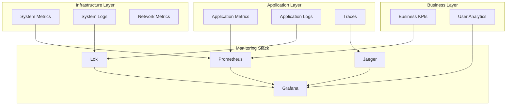

# Conea Integration Platform - 監視ガイド

## 目次

1. [監視戦略](#監視戦略)
2. [メトリクス監視](#メトリクス監視)
3. [ログ管理](#ログ管理)
4. [分散トレーシング](#分散トレーシング)
5. [アラート設定](#アラート設定)
6. [ダッシュボード](#ダッシュボード)
7. [SLI/SLO設定](#slislo設定)
8. [監視ツールの使い方](#監視ツールの使い方)

## 監視戦略

### 4つのゴールデンシグナル

Coneaの監視は、Google SREの「4つのゴールデンシグナル」に基づいています：

1. **レイテンシ**: リクエストの応答時間
2. **トラフィック**: システムへのリクエスト量
3. **エラー**: 失敗したリクエストの割合
4. **飽和度**: リソースの使用率

### 監視レイヤー



## メトリクス監視

### Prometheusメトリクス

#### アプリケーションメトリクス

```yaml
# カスタムメトリクスの定義
metrics:
  # HTTPリクエスト
  - name: http_requests_total
    type: counter
    help: Total number of HTTP requests
    labels: [method, endpoint, status]
  
  # レスポンスタイム
  - name: http_request_duration_seconds
    type: histogram
    help: HTTP request latency
    labels: [method, endpoint]
    buckets: [0.005, 0.01, 0.025, 0.05, 0.1, 0.25, 0.5, 1, 2.5, 5, 10]
  
  # AIモデル使用量
  - name: ai_model_requests_total
    type: counter
    help: Total AI model requests
    labels: [model, provider, status]
  
  # データ処理
  - name: data_processing_jobs_total
    type: counter
    help: Total data processing jobs
    labels: [job_type, status]
```

#### メトリクス収集設定

```yaml
# prometheus.yml
global:
  scrape_interval: 15s
  evaluation_interval: 15s

scrape_configs:
  # アプリケーション
  - job_name: 'conea-api'
    kubernetes_sd_configs:
      - role: pod
        namespaces:
          names: ['production']
    relabel_configs:
      - source_labels: [__meta_kubernetes_pod_label_app]
        action: keep
        regex: conea-api
      - source_labels: [__meta_kubernetes_pod_name]
        target_label: pod
      - source_labels: [__meta_kubernetes_namespace]
        target_label: namespace
  
  # Kubernetes
  - job_name: 'kubernetes-nodes'
    kubernetes_sd_configs:
      - role: node
    relabel_configs:
      - action: labelmap
        regex: __meta_kubernetes_node_label_(.+)
  
  # データベース
  - job_name: 'postgresql'
    static_configs:
      - targets: ['postgres-exporter:9187']
```

### 主要メトリクス

#### システムメトリクス

```promql
# CPU使用率
100 - (avg by (instance) (rate(node_cpu_seconds_total{mode="idle"}[5m])) * 100)

# メモリ使用率
(1 - (node_memory_MemAvailable_bytes / node_memory_MemTotal_bytes)) * 100

# ディスク使用率
(node_filesystem_size_bytes - node_filesystem_free_bytes) / node_filesystem_size_bytes * 100

# ネットワークトラフィック
rate(node_network_receive_bytes_total[5m])
rate(node_network_transmit_bytes_total[5m])
```

#### アプリケーションメトリクス

```promql
# リクエストレート
sum(rate(http_requests_total[5m])) by (endpoint)

# エラーレート
sum(rate(http_requests_total{status=~"5.."}[5m])) / sum(rate(http_requests_total[5m]))

# レスポンスタイム（p95）
histogram_quantile(0.95, sum(rate(http_request_duration_seconds_bucket[5m])) by (le, endpoint))

# 同時接続数
sum(tcp_connections{state="established"})
```

## ログ管理

### ログ収集設定

```yaml
# fluent-bit-config.yaml
apiVersion: v1
kind: ConfigMap
metadata:
  name: fluent-bit-config
data:
  fluent-bit.conf: |
    [SERVICE]
        Flush         1
        Log_Level     info
        Daemon        off
        Parsers_File  parsers.conf
    
    [INPUT]
        Name              tail
        Path              /var/log/containers/*.log
        Parser            docker
        Tag               kube.*
        Refresh_Interval  5
        Mem_Buf_Limit     50MB
        Skip_Long_Lines   On
    
    [FILTER]
        Name                kubernetes
        Match               kube.*
        Merge_Log           On
        Keep_Log            Off
        K8S-Logging.Parser  On
        K8S-Logging.Exclude On
    
    [OUTPUT]
        Name   loki
        Match  *
        Host   loki.monitoring.svc.cluster.local
        Port   3100
        Labels job=fluent-bit, app=$kubernetes['labels']['app']
```

### 構造化ログフォーマット

```json
{
  "timestamp": "2025-05-26T10:30:45.123Z",
  "level": "info",
  "service": "conea-api",
  "trace_id": "abc123def456",
  "span_id": "789ghi012",
  "user_id": "user_123",
  "organization_id": "org_456",
  "method": "POST",
  "path": "/api/v1/ai/chat",
  "status": 200,
  "duration_ms": 245,
  "message": "AI chat request completed",
  "metadata": {
    "model": "gpt-4",
    "tokens": 1250,
    "cost": 0.0375
  }
}
```

### ログクエリ例

```logql
# エラーログの検索
{app="conea-api"} |= "error" | json | level="error"

# 特定ユーザーのログ
{app="conea-api"} | json | user_id="user_123"

# レスポンスタイムが遅いリクエスト
{app="conea-api"} | json | duration_ms > 1000

# 5xxエラーの集計
sum by (status) (
  rate({app="conea-api"} | json | status >= 500 [5m])
)
```

## 分散トレーシング

### Jaeger設定

```yaml
# jaeger-deployment.yaml
apiVersion: apps/v1
kind: Deployment
metadata:
  name: jaeger
spec:
  template:
    spec:
      containers:
      - name: jaeger
        image: jaegertracing/all-in-one:1.45
        env:
        - name: COLLECTOR_ZIPKIN_HOST_PORT
          value: ":9411"
        - name: SPAN_STORAGE_TYPE
          value: elasticsearch
        - name: ES_SERVER_URLS
          value: http://elasticsearch:9200
        ports:
        - containerPort: 5775
          protocol: UDP
        - containerPort: 6831
          protocol: UDP
        - containerPort: 6832
          protocol: UDP
        - containerPort: 5778
          protocol: TCP
        - containerPort: 16686
          protocol: TCP
        - containerPort: 14268
          protocol: TCP
        - containerPort: 9411
          protocol: TCP
```

### トレーシング実装

```javascript
// トレーシングの初期化
const { initTracer } = require('jaeger-client');
const opentracing = require('opentracing');

const config = {
  serviceName: 'conea-api',
  sampler: {
    type: 'probabilistic',
    param: 0.1, // 10%のリクエストをサンプリング
  },
  reporter: {
    logSpans: true,
    agentHost: process.env.JAEGER_AGENT_HOST || 'localhost',
    agentPort: process.env.JAEGER_AGENT_PORT || 6831,
  },
};

const tracer = initTracer(config);

// ミドルウェアでの使用
app.use((req, res, next) => {
  const span = tracer.startSpan('http_request');
  span.setTag('http.method', req.method);
  span.setTag('http.url', req.url);
  
  req.span = span;
  
  res.on('finish', () => {
    span.setTag('http.status_code', res.statusCode);
    span.finish();
  });
  
  next();
});
```

## アラート設定

### アラートルール

```yaml
# alerts.yaml
groups:
  - name: conea_critical
    interval: 30s
    rules:
      # サービスダウン
      - alert: ServiceDown
        expr: up{job="conea-api"} == 0
        for: 2m
        labels:
          severity: critical
          team: platform
        annotations:
          summary: "Service {{ $labels.instance }} is down"
          description: "{{ $labels.job }} has been down for more than 2 minutes"
          runbook_url: "https://docs.conea.io/runbooks/service-down"
      
      # 高エラーレート
      - alert: HighErrorRate
        expr: |
          (
            sum(rate(http_requests_total{status=~"5.."}[5m]))
            /
            sum(rate(http_requests_total[5m]))
          ) > 0.05
        for: 5m
        labels:
          severity: critical
          team: platform
        annotations:
          summary: "High error rate detected"
          description: "Error rate is {{ $value | humanizePercentage }} for the last 5 minutes"
      
      # 高レスポンスタイム
      - alert: HighLatency
        expr: |
          histogram_quantile(0.95,
            sum(rate(http_request_duration_seconds_bucket[5m])) by (le)
          ) > 1
        for: 10m
        labels:
          severity: warning
          team: platform
        annotations:
          summary: "High latency detected"
          description: "95th percentile latency is {{ $value }}s"
  
  - name: conea_resources
    interval: 60s
    rules:
      # CPU使用率
      - alert: HighCPUUsage
        expr: |
          (
            100 - (avg by (instance) (rate(node_cpu_seconds_total{mode="idle"}[5m])) * 100)
          ) > 80
        for: 15m
        labels:
          severity: warning
          team: platform
        annotations:
          summary: "High CPU usage on {{ $labels.instance }}"
          description: "CPU usage is {{ $value }}%"
      
      # メモリ使用率
      - alert: HighMemoryUsage
        expr: |
          (
            (1 - (node_memory_MemAvailable_bytes / node_memory_MemTotal_bytes)) * 100
          ) > 85
        for: 15m
        labels:
          severity: warning
          team: platform
        annotations:
          summary: "High memory usage on {{ $labels.instance }}"
          description: "Memory usage is {{ $value }}%"
      
      # ディスク使用率
      - alert: HighDiskUsage
        expr: |
          (
            (node_filesystem_size_bytes - node_filesystem_free_bytes)
            / node_filesystem_size_bytes * 100
          ) > 85
        for: 30m
        labels:
          severity: warning
          team: platform
        annotations:
          summary: "High disk usage on {{ $labels.instance }}"
          description: "Disk usage is {{ $value }}% on {{ $labels.device }}"
```

### アラート通知設定

```yaml
# alertmanager.yml
global:
  resolve_timeout: 5m
  slack_api_url: 'YOUR_SLACK_WEBHOOK_URL'

route:
  group_by: ['alertname', 'cluster', 'service']
  group_wait: 10s
  group_interval: 10s
  repeat_interval: 12h
  receiver: 'default'
  routes:
  - match:
      severity: critical
    receiver: 'critical'
    continue: true
  - match:
      severity: warning
    receiver: 'warning'

receivers:
- name: 'default'
  slack_configs:
  - channel: '#alerts'
    title: 'Conea Alert'
    text: '{{ range .Alerts }}{{ .Annotations.summary }}{{ end }}'

- name: 'critical'
  slack_configs:
  - channel: '#alerts-critical'
    title: '🚨 CRITICAL: {{ .GroupLabels.alertname }}'
    text: '{{ range .Alerts }}{{ .Annotations.description }}{{ end }}'
  pagerduty_configs:
  - service_key: 'YOUR_PAGERDUTY_KEY'

- name: 'warning'
  slack_configs:
  - channel: '#alerts-warning'
    title: '⚠️ WARNING: {{ .GroupLabels.alertname }}'
    text: '{{ range .Alerts }}{{ .Annotations.description }}{{ end }}'
```

## ダッシュボード

### Grafanaダッシュボード設定

#### システムオーバービュー

```json
{
  "dashboard": {
    "title": "Conea System Overview",
    "panels": [
      {
        "title": "Request Rate",
        "targets": [
          {
            "expr": "sum(rate(http_requests_total[5m])) by (endpoint)"
          }
        ],
        "type": "graph"
      },
      {
        "title": "Error Rate",
        "targets": [
          {
            "expr": "sum(rate(http_requests_total{status=~\"5..\"}[5m])) / sum(rate(http_requests_total[5m])) * 100"
          }
        ],
        "type": "singlestat",
        "thresholds": "1,5",
        "colors": ["green", "yellow", "red"]
      },
      {
        "title": "Response Time (p95)",
        "targets": [
          {
            "expr": "histogram_quantile(0.95, sum(rate(http_request_duration_seconds_bucket[5m])) by (le))"
          }
        ],
        "type": "graph"
      },
      {
        "title": "Active Users",
        "targets": [
          {
            "expr": "sum(increase(user_activity_total[5m]))"
          }
        ],
        "type": "singlestat"
      }
    ]
  }
}
```

### カスタムダッシュボード

#### AIモデル使用状況

```json
{
  "panels": [
    {
      "title": "AI Model Requests by Provider",
      "targets": [
        {
          "expr": "sum(rate(ai_model_requests_total[5m])) by (provider, model)"
        }
      ],
      "type": "piechart"
    },
    {
      "title": "AI Processing Time",
      "targets": [
        {
          "expr": "histogram_quantile(0.95, sum(rate(ai_processing_duration_seconds_bucket[5m])) by (le, model))"
        }
      ],
      "type": "graph"
    },
    {
      "title": "Token Usage",
      "targets": [
        {
          "expr": "sum(increase(ai_tokens_total[1h])) by (model)"
        }
      ],
      "type": "bargauge"
    }
  ]
}
```

## SLI/SLO設定

### サービスレベル指標（SLI）

```yaml
slis:
  # 可用性
  availability:
    metric: |
      sum(rate(http_requests_total{status!~"5.."}[5m]))
      /
      sum(rate(http_requests_total[5m]))
    
  # レイテンシ
  latency:
    metric: |
      histogram_quantile(0.95,
        sum(rate(http_request_duration_seconds_bucket[5m])) by (le)
      )
    
  # エラー率
  error_rate:
    metric: |
      sum(rate(http_requests_total{status=~"5.."}[5m]))
      /
      sum(rate(http_requests_total[5m]))
```

### サービスレベル目標（SLO）

```yaml
slos:
  - name: API Availability
    sli: availability
    target: 99.9
    window: 30d
    
  - name: API Latency
    sli: latency
    target_value: 0.5  # 500ms
    target_percentile: 95
    window: 30d
    
  - name: Error Budget
    sli: error_rate
    target: 0.1  # 0.1%
    window: 30d
```

### エラーバジェット監視

```promql
# 残りエラーバジェット（%）
(
  1 - (
    sum(increase(http_requests_total{status=~"5.."}[30d]))
    /
    sum(increase(http_requests_total[30d]))
  )
) * 100 - 99.9

# エラーバジェット消費率
(
  sum(rate(http_requests_total{status=~"5.."}[1h]))
  /
  sum(rate(http_requests_total[1h]))
) / 0.001  # 0.1% エラーバジェット
```

## 監視ツールの使い方

### Prometheus クエリ

```bash
# CLIでのクエリ実行
promtool query instant http://prometheus:9090 'up{job="conea-api"}'

# 範囲クエリ
curl -G http://prometheus:9090/api/v1/query_range \
  --data-urlencode 'query=rate(http_requests_total[5m])' \
  --data-urlencode 'start=2025-05-26T00:00:00Z' \
  --data-urlencode 'end=2025-05-26T12:00:00Z' \
  --data-urlencode 'step=15s'
```

### Grafana Loki

```bash
# ログの検索
logcli query '{app="conea-api"} |= "error"' --limit=100

# ログのストリーミング
logcli query '{app="conea-api"}' --tail

# 統計情報
logcli series '{app="conea-api"}'
```

### Jaeger トレース

```bash
# トレースの検索
curl "http://jaeger:16686/api/traces?service=conea-api&limit=20"

# 特定のトレースID
curl "http://jaeger:16686/api/traces/abc123def456"

# サービス依存関係
curl "http://jaeger:16686/api/dependencies?endTs=$(date +%s)000"
```

### 監視の自動化

```python
# monitoring_automation.py
import requests
import json
from datetime import datetime, timedelta

class MonitoringAutomation:
    def __init__(self, prometheus_url, alertmanager_url):
        self.prometheus_url = prometheus_url
        self.alertmanager_url = alertmanager_url
    
    def check_slo_compliance(self, slo_name, target, window_days=30):
        """SLOコンプライアンスをチェック"""
        end_time = datetime.now()
        start_time = end_time - timedelta(days=window_days)
        
        query = f'''
            avg_over_time(
                (sum(rate(http_requests_total{{status!~"5.."}}[5m])) 
                / 
                sum(rate(http_requests_total[5m])))[{window_days}d:]
            ) * 100
        '''
        
        response = requests.get(
            f"{self.prometheus_url}/api/v1/query",
            params={'query': query}
        )
        
        result = response.json()
        current_sli = float(result['data']['result'][0]['value'][1])
        
        return {
            'slo_name': slo_name,
            'target': target,
            'current': current_sli,
            'compliant': current_sli >= target,
            'margin': current_sli - target
        }
    
    def generate_capacity_report(self):
        """キャパシティレポートの生成"""
        metrics = [
            ('CPU Usage', 'avg(100 - (rate(node_cpu_seconds_total{mode="idle"}[5m]) * 100))'),
            ('Memory Usage', 'avg((1 - (node_memory_MemAvailable_bytes / node_memory_MemTotal_bytes)) * 100)'),
            ('Disk Usage', 'avg((node_filesystem_size_bytes - node_filesystem_free_bytes) / node_filesystem_size_bytes * 100)')
        ]
        
        report = {}
        for name, query in metrics:
            response = requests.get(
                f"{self.prometheus_url}/api/v1/query",
                params={'query': query}
            )
            result = response.json()
            report[name] = float(result['data']['result'][0]['value'][1])
        
        return report

# 使用例
monitor = MonitoringAutomation(
    prometheus_url="http://prometheus:9090",
    alertmanager_url="http://alertmanager:9093"
)

# SLOチェック
slo_result = monitor.check_slo_compliance("API Availability", 99.9)
print(f"SLO Compliance: {slo_result}")

# キャパシティレポート
capacity = monitor.generate_capacity_report()
print(f"Capacity Report: {capacity}")
```

---

最終更新日: 2025年5月26日