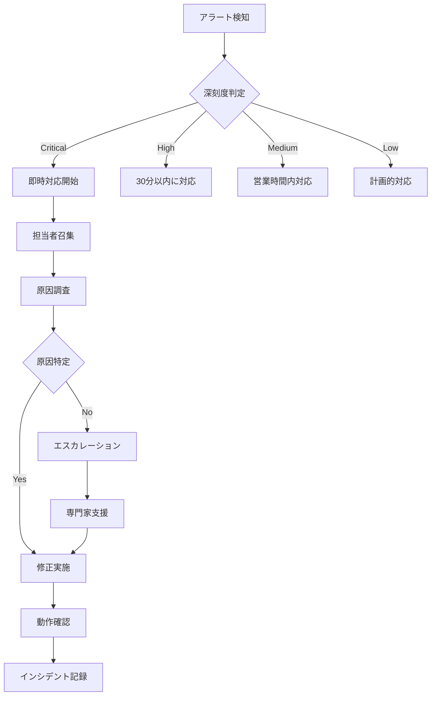

# Conea Integration Platform - 運用マニュアル

## 目次

1. [概要](#概要)
2. [環境構成](#環境構成)
3. [デプロイメント手順](#デプロイメント手順)
4. [日常運用](#日常運用)
5. [監視とアラート](#監視とアラート)
6. [バックアップとリストア](#バックアップとリストア)
7. [スケーリング](#スケーリング)
8. [メンテナンス](#メンテナンス)
9. [緊急時対応](#緊急時対応)

## 概要

本マニュアルは、Conea Integration Platformの運用に必要な手順と知識をまとめたものです。システムの安定稼働と効率的な運用を目的としています。

### 運用チーム体制

| 役割 | 責任範囲 | 必要スキル |
|------|---------|-----------|
| SRE Lead | システム全体の監視、インシデント対応統括 | Kubernetes、クラウドインフラ、SRE原則 |
| Platform Engineer | インフラ管理、自動化推進 | Docker、Kubernetes、Terraform |
| Database Administrator | データベース運用、パフォーマンス最適化 | PostgreSQL、レプリケーション、チューニング |
| Security Engineer | セキュリティ監視、脆弱性対応 | セキュリティツール、ペンテスト、コンプライアンス |

## 環境構成

### 環境一覧

| 環境 | 用途 | URL | 構成 |
|------|------|-----|------|
| Production | 本番環境 | https://api.conea.io | マルチリージョン、HA構成 |
| Staging | ステージング環境 | https://staging-api.conea.io | 本番相当、単一リージョン |
| Development | 開発環境 | https://dev-api.conea.io | 最小構成 |

### インフラストラクチャ構成

```yaml
# Production環境の構成
production:
  regions:
    - us-east-1 (Primary)
    - eu-west-1 (Secondary)
    - ap-northeast-1 (Secondary)
  
  kubernetes:
    clusters: 3
    nodes_per_cluster: 10
    node_type: c5.2xlarge
    
  database:
    type: PostgreSQL
    version: 14.x
    instances:
      primary: db.r6g.2xlarge
      replicas: 2 x db.r6g.xlarge
    
  cache:
    type: Redis
    version: 6.x
    cluster_mode: enabled
    nodes: 6
    
  storage:
    s3_buckets:
      - conea-production-files
      - conea-production-backups
      - conea-production-logs
```

## デプロイメント手順

### 前提条件

```bash
# 必要なツールの確認
kubectl version --client
helm version
docker version
terraform version

# 認証情報の設定
export AWS_PROFILE=conea-production
aws sts get-caller-identity

# Kubernetesコンテキストの設定
kubectl config use-context conea-production
```

### 標準デプロイメント

```bash
# 1. コードの準備
git checkout main
git pull origin main
git tag -a v1.0.0 -m "Release version 1.0.0"
git push origin v1.0.0

# 2. Dockerイメージのビルドとプッシュ
docker build -t conea/api:v1.0.0 .
docker push conea/api:v1.0.0

# 3. Helm Chartの更新
cd helm/conea
helm dependency update

# 4. Dry-run実行
helm upgrade --install conea . \
  --namespace production \
  --values values.production.yaml \
  --dry-run

# 5. 本番デプロイ
helm upgrade --install conea . \
  --namespace production \
  --values values.production.yaml \
  --timeout 10m \
  --wait

# 6. デプロイメント確認
kubectl rollout status deployment/conea-api -n production
kubectl get pods -n production -l app=conea-api
```

### Blue-Greenデプロイメント

```bash
# 1. Green環境の準備
kubectl apply -f k8s/deployment-green.yaml

# 2. Green環境の確認
kubectl wait --for=condition=ready pod -l version=green -n production

# 3. トラフィックの段階的切り替え
kubectl patch service conea-api -n production \
  -p '{"spec":{"selector":{"version":"green"}}}'

# 4. Blue環境の削除（問題がない場合）
kubectl delete deployment conea-api-blue -n production
```

### ロールバック手順

```bash
# Helmを使用したロールバック
helm rollback conea 1 -n production

# Kubernetesネイティブなロールバック
kubectl rollout undo deployment/conea-api -n production

# 特定のリビジョンへのロールバック
kubectl rollout undo deployment/conea-api -n production --to-revision=3
```

## 日常運用

### ヘルスチェック

```bash
# APIヘルスチェック
curl -f https://api.conea.io/health || echo "Health check failed"

# Kubernetes Pod状態確認
kubectl get pods -n production -o wide

# サービス状態確認
kubectl get svc -n production

# リソース使用状況
kubectl top nodes
kubectl top pods -n production
```

### ログ確認

```bash
# アプリケーションログ
kubectl logs -f deployment/conea-api -n production

# 特定のPodのログ
kubectl logs -f conea-api-7d9b8c6f5-xvn4m -n production

# 過去1時間のエラーログ
kubectl logs deployment/conea-api -n production --since=1h | grep ERROR

# 集約ログの確認（Elasticsearch）
curl -X GET "https://logs.conea.io/_search" -H 'Content-Type: application/json' -d'
{
  "query": {
    "bool": {
      "must": [
        { "match": { "level": "error" }},
        { "range": { "@timestamp": { "gte": "now-1h" }}}
      ]
    }
  }
}'
```

### パフォーマンス監視

```bash
# CPU/メモリ使用率
kubectl top pods -n production --sort-by=cpu
kubectl top pods -n production --sort-by=memory

# データベース接続数
psql -h db.conea.io -U monitoring -c "
SELECT count(*) as connection_count,
       state,
       application_name
FROM pg_stat_activity
GROUP BY state, application_name
ORDER BY connection_count DESC;"

# APIレスポンスタイム
curl -w "@curl-format.txt" -o /dev/null -s https://api.conea.io/health
```

## 監視とアラート

### Prometheusメトリクス

```yaml
# prometheus-rules.yaml
groups:
  - name: conea_alerts
    interval: 30s
    rules:
      # 高レスポンスタイム
      - alert: HighResponseTime
        expr: http_request_duration_seconds{quantile="0.95"} > 0.5
        for: 5m
        labels:
          severity: warning
        annotations:
          summary: "High response time detected"
          description: "95th percentile response time is above 500ms"
      
      # エラーレート
      - alert: HighErrorRate
        expr: rate(http_requests_total{status=~"5.."}[5m]) > 0.05
        for: 5m
        labels:
          severity: critical
        annotations:
          summary: "High error rate detected"
          description: "Error rate is above 5%"
      
      # Pod再起動
      - alert: PodRestartingTooOften
        expr: rate(kube_pod_container_status_restarts_total[15m]) > 0
        for: 5m
        labels:
          severity: warning
        annotations:
          summary: "Pod is restarting frequently"
```

### Grafanaダッシュボード

主要ダッシュボード:
1. **System Overview**: CPU、メモリ、ネットワーク使用状況
2. **API Performance**: レスポンスタイム、スループット、エラー率
3. **Database Metrics**: 接続数、クエリ性能、レプリケーション遅延
4. **Business Metrics**: API使用量、ユーザーアクティビティ

### アラート対応手順

```bash
# アラート確認
kubectl get events -n production --sort-by='.lastTimestamp'

# CPU高負荷時の対応
# 1. 負荷の高いPodを特定
kubectl top pods -n production --sort-by=cpu

# 2. 水平スケーリング
kubectl scale deployment conea-api -n production --replicas=10

# 3. 負荷の原因調査
kubectl exec -it conea-api-xxx -n production -- top
kubectl exec -it conea-api-xxx -n production -- netstat -an | grep ESTABLISHED | wc -l
```

## バックアップとリストア

### 自動バックアップ設定

```yaml
# backup-cronjob.yaml
apiVersion: batch/v1
kind: CronJob
metadata:
  name: database-backup
  namespace: production
spec:
  schedule: "0 2 * * *"  # 毎日2:00 AM
  jobTemplate:
    spec:
      template:
        spec:
          containers:
          - name: postgres-backup
            image: postgres:14
            command:
            - /bin/bash
            - -c
            - |
              DATE=$(date +%Y%m%d_%H%M%S)
              pg_dump -h $DB_HOST -U $DB_USER -d $DB_NAME | \
              gzip | \
              aws s3 cp - s3://conea-production-backups/postgres/backup_$DATE.sql.gz
            env:
            - name: DB_HOST
              value: "db.conea.io"
            - name: DB_USER
              valueFrom:
                secretKeyRef:
                  name: db-credentials
                  key: username
```

### 手動バックアップ

```bash
# データベースバックアップ
DATE=$(date +%Y%m%d_%H%M%S)
pg_dump -h db.conea.io -U postgres conea_production | \
  gzip > backup_$DATE.sql.gz

# S3へアップロード
aws s3 cp backup_$DATE.sql.gz s3://conea-production-backups/manual/

# Kubernetesリソースバックアップ
kubectl get all -n production -o yaml > k8s_backup_$DATE.yaml
```

### リストア手順

```bash
# 1. バックアップファイルの確認
aws s3 ls s3://conea-production-backups/postgres/ --recursive

# 2. バックアップのダウンロード
aws s3 cp s3://conea-production-backups/postgres/backup_20250526_020000.sql.gz .

# 3. データベースのリストア
gunzip -c backup_20250526_020000.sql.gz | \
  psql -h db.conea.io -U postgres -d conea_production_restore

# 4. データ確認
psql -h db.conea.io -U postgres -d conea_production_restore -c "
SELECT COUNT(*) FROM users;
SELECT COUNT(*) FROM organizations;
SELECT MAX(created_at) FROM audit_logs;"
```

## スケーリング

### 水平スケーリング

```bash
# Pod数の調整
kubectl scale deployment conea-api -n production --replicas=20

# HPA（Horizontal Pod Autoscaler）の設定
kubectl autoscale deployment conea-api -n production \
  --cpu-percent=70 \
  --min=5 \
  --max=50

# HPA状態確認
kubectl get hpa -n production
```

### 垂直スケーリング

```yaml
# リソース要求の更新
apiVersion: apps/v1
kind: Deployment
metadata:
  name: conea-api
spec:
  template:
    spec:
      containers:
      - name: api
        resources:
          requests:
            memory: "1Gi"
            cpu: "1000m"
          limits:
            memory: "4Gi"
            cpu: "4000m"
```

### データベーススケーリング

```sql
-- 読み取りレプリカの追加
-- AWS RDSの場合
aws rds create-db-instance-read-replica \
  --db-instance-identifier conea-production-replica-3 \
  --source-db-instance-identifier conea-production \
  --db-instance-class db.r6g.xlarge

-- 接続プーリングの調整
ALTER SYSTEM SET max_connections = 500;
ALTER SYSTEM SET shared_buffers = '8GB';
SELECT pg_reload_conf();
```

## メンテナンス

### 定期メンテナンス

#### 週次タスク
```bash
# 1. セキュリティパッチの確認
kubectl get nodes -o json | jq '.items[].status.nodeInfo'

# 2. 証明書の有効期限確認
echo | openssl s_client -servername api.conea.io -connect api.conea.io:443 2>/dev/null | openssl x509 -noout -dates

# 3. ディスク使用量確認
kubectl exec -it conea-api-xxx -n production -- df -h
```

#### 月次タスク
```bash
# 1. データベースVACUUM
psql -h db.conea.io -U postgres -d conea_production -c "VACUUM ANALYZE;"

# 2. 古いログの削除
aws s3 rm s3://conea-production-logs/ --recursive --exclude "*" --include "*.log" --older-than 90

# 3. 未使用のDockerイメージ削除
docker system prune -a --filter "until=720h"
```

### データベースメンテナンス

```sql
-- インデックスの再構築
REINDEX DATABASE conea_production;

-- テーブル統計の更新
ANALYZE;

-- 肥大化したテーブルの確認
SELECT
  schemaname,
  tablename,
  pg_size_pretty(pg_total_relation_size(schemaname||'.'||tablename)) AS size,
  pg_size_pretty(pg_relation_size(schemaname||'.'||tablename)) AS table_size
FROM pg_tables
WHERE schemaname NOT IN ('pg_catalog', 'information_schema')
ORDER BY pg_total_relation_size(schemaname||'.'||tablename) DESC
LIMIT 20;
```

## 緊急時対応

### インシデント対応フロー



### トラブルシューティング

#### API応答なし
```bash
# 1. Pod状態確認
kubectl get pods -n production -l app=conea-api

# 2. 最近のイベント確認
kubectl get events -n production --sort-by='.lastTimestamp' | head -20

# 3. ログ確認
kubectl logs -f deployment/conea-api -n production --tail=100

# 4. 一時的な再起動
kubectl rollout restart deployment/conea-api -n production
```

#### データベース接続エラー
```bash
# 1. 接続テスト
psql -h db.conea.io -U postgres -c "SELECT 1;"

# 2. 接続数確認
psql -h db.conea.io -U postgres -c "SELECT count(*) FROM pg_stat_activity;"

# 3. ロック状況確認
psql -h db.conea.io -U postgres -c "
SELECT pid, usename, query, state, wait_event_type, wait_event
FROM pg_stat_activity
WHERE wait_event_type IS NOT NULL;"

# 4. 問題のあるクエリの強制終了
psql -h db.conea.io -U postgres -c "SELECT pg_terminate_backend(pid) FROM pg_stat_activity WHERE state = 'idle in transaction' AND state_change < NOW() - INTERVAL '10 minutes';"
```

#### 高負荷対応
```bash
# 1. 負荷源の特定
kubectl top pods -n production --sort-by=cpu
kubectl exec -it conea-api-xxx -n production -- top -bn1

# 2. 一時的なスケールアウト
kubectl scale deployment conea-api -n production --replicas=30

# 3. レート制限の強化
kubectl set env deployment/conea-api -n production RATE_LIMIT_PER_MINUTE=100

# 4. CDNキャッシュの有効化
curl -X POST "https://api.cloudflare.com/client/v4/zones/ZONE_ID/purge_cache" \
     -H "Authorization: Bearer TOKEN" \
     -H "Content-Type: application/json" \
     --data '{"purge_everything":true}'
```

### 災害復旧

```bash
# 1. 被害状況の確認
kubectl get nodes
kubectl get pods -n production
aws rds describe-db-instances

# 2. セカンダリリージョンへの切り替え
# DNS更新
aws route53 change-resource-record-sets --hosted-zone-id Z123456 --change-batch file://failover.json

# 3. データベースのフェイルオーバー
aws rds failover-db-cluster --db-cluster-identifier conea-production

# 4. サービス復旧確認
for i in {1..10}; do
  curl -f https://api.conea.io/health && echo "Service is up" || echo "Service is down"
  sleep 30
done
```

---

最終更新日: 2025年5月26日