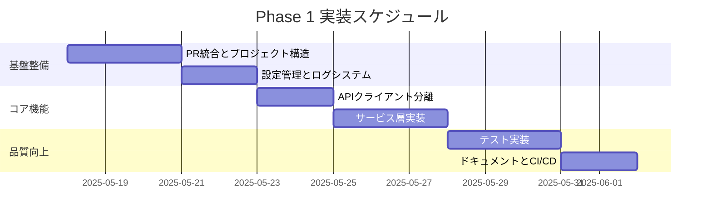

# Phase 1: Python コード改善計画

**作成者**: 主任エンジニア  
**作成日**: 2025年5月17日  
**計画期間**: Week 1-2（約10営業日）

## 1. PR評価と統合判断

### PR #1: Enhance Shopify API integration (Devin)

**評価**: 部分的に統合推奨

**有益な変更点**:
- ✅ 改善されたエラーハンドリング
- ✅ 在庫データ取得メソッドの追加
- ✅ 環境変数設定の明確化（.env.example）
- ✅ 日本語ドキュメントの追加

**懸念事項**:
- ❌ モノリシック構造の継続
- ❌ テストの欠如
- ❌ エラーハンドリングの一貫性不足

**統合方針**: 
- エラーハンドリングと新機能を選択的に統合
- アーキテクチャリファクタリング後に完全統合

### PR #2: Add pytest framework and CI (CODEX)

**評価**: 即時統合推奨

**有益な変更点**:
- ✅ プロジェクト構造のパッケージ化
- ✅ pytest フレームワークの導入
- ✅ CI/CD パイプラインの基礎
- ✅ コード品質チェック（ruff）

**統合方針**:
- PR #2を優先的にマージ（プロジェクト構造の基盤）
- その後、PR #1の機能を新構造に適応

## 2. Phase 1 タスクリスト

### 優先度1: 基盤整備（Day 1-3）

| タスク | 工数 | 担当候補 | 説明 |
|--------|------|----------|------|
| PR #2マージ | 2h | リードエンジニア | プロジェクト構造の確立 |
| ディレクトリ構造整備 | 4h | シニアエンジニア | src/, tests/, config/ の作成 |
| 設定管理システム | 8h | シニアエンジニア | pydantic による設定管理 |
| ログシステム構築 | 6h | ジュニアエンジニア | structlog の導入 |

### 優先度2: コア機能リファクタリング（Day 4-7）

| タスク | 工数 | 担当候補 | 説明 |
|--------|------|----------|------|
| ShopifyAPIクラス分離 | 8h | シニアエンジニア | api/shopify_client.py へ移行 |
| サービス層の実装 | 12h | リードエンジニア | analytics, visualization サービス |
| エラーハンドリング統一 | 8h | シニアエンジニア | カスタム例外クラスの実装 |
| PR #1機能統合 | 6h | ジュニアエンジニア | 在庫管理機能の統合 |

### 優先度3: 品質向上（Day 8-10）

| タスク | 工数 | 担当候補 | 説明 |
|--------|------|----------|------|
| ユニットテスト作成 | 16h | 全員 | 主要機能のテスト実装 |
| 統合テスト作成 | 8h | シニアエンジニア | APIモックを使用したテスト |
| ドキュメント整備 | 8h | ジュニアエンジニア | docstring, README更新 |
| CI/CD完全化 | 4h | リードエンジニア | GitHub Actions の拡充 |

## 3. 技術的指針

### コード品質

```python
# 推奨するコード構造例
from typing import Dict, List, Optional
from dataclasses import dataclass
from datetime import datetime
import logging

from pydantic import BaseSettings
from structlog import get_logger

logger = get_logger()

@dataclass
class OrderSummary:
    """注文サマリーのデータクラス"""
    total_orders: int
    total_revenue: float
    period: str
    currency: str = "JPY"

class ShopifyConfig(BaseSettings):
    """Shopify設定の型定義"""
    api_version: str = "2023-10"
    api_key: str
    access_token: str
    shop_name: str
    
    class Config:
        env_prefix = "SHOPIFY_"
```

### パフォーマンス指針
- 非同期処理の完全活用
- バッチ処理の実装
- キャッシング戦略の検討

### セキュリティ指針
- 環境変数の厳密な管理
- APIキーの暗号化検討
- 入力値の検証強化

## 4. Node.js Gateway（Phase 2）準備計画

### 基本方針
- Express.js によるAPIゲートウェイ
- gRPC または REST でPythonと通信
- 認証・認可の一元管理

### 技術要件
```javascript
// Gateway設計の基本構造
const express = require('express');
const grpc = require('@grpc/grpc-js');

class Gateway {
  constructor(config) {
    this.app = express();
    this.pythonClient = this.createGRPCClient(config.pythonUrl);
  }
  
  setupRoutes() {
    this.app.get('/api/orders', this.handleOrders.bind(this));
    this.app.get('/api/analytics', this.handleAnalytics.bind(this));
  }
  
  async handleOrders(req, res) {
    try {
      const data = await this.pythonClient.getOrders(req.query);
      res.json(data);
    } catch (error) {
      res.status(500).json({ error: error.message });
    }
  }
}
```

### 連携ポイント
1. **APIエンドポイント**: 全てのHTTPリクエスト
2. **認証**: JWTトークンによる認証
3. **データ変換**: JSON ↔ Protocol Buffers
4. **エラー処理**: 統一的なエラーレスポンス

### 必要スキル
- Express.js/Fastify
- gRPC/REST API設計
- TypeScript
- Docker/Kubernetes基礎
- JWT認証

## 5. 実装スケジュール



## 6. 成功指標

- テストカバレッジ: 80%以上
- コード品質スコア: A評価（SonarQube基準）
- APIレスポンス時間: 200ms以下
- エラー率: 0.1%以下

## 7. リスクと対策

| リスク | 影響 | 対策 |
|--------|------|------|
| PR統合の遅延 | 高 | 段階的統合とチェリーピック |
| テスト作成の工数超過 | 中 | 優先度の高い機能から段階的に |
| パフォーマンス劣化 | 中 | 継続的なベンチマークテスト |

## 8. 次のステップ

1. **即時アクション**:
   - PR #2のマージ実行
   - プロジェクト構造の整備開始

2. **Day 1-3完了目標**:
   - 基本的なプロジェクト構造確立
   - CI/CDパイプライン稼働

3. **Week 1完了目標**:
   - コア機能のリファクタリング完了
   - 基本的なテストカバレッジ確保

4. **Week 2完了目標**:
   - 全テスト実装
   - ドキュメント完成
   - Phase 2への準備完了

---

この計画は柔軟性を持って運用し、日次で進捗を確認・調整します。