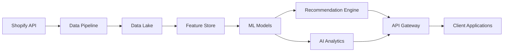

# Phase 4: AI強化アーキテクチャ

## 概要

Phase 4では、Shopify MCPサーバーにAI/ML機能を統合し、高度な分析と自動化を実現します。

## アーキテクチャ構成

### 1. コアコンポーネント

#### 1.1 推薦エンジン (RecommendationEngine)
- **目的**: パーソナライズされた商品推薦の提供
- **技術**:
  - 協調フィルタリング（ユーザーベース・アイテムベース）
  - コンテンツベースフィルタリング
  - ディープラーニング（TensorFlow.js）によるハイブリッド推薦
- **機能**:
  - リアルタイム推薦生成
  - A/Bテストフレームワーク
  - 推薦理由の説明機能

#### 1.2 データパイプライン (DataPipeline)
- **目的**: Shopifyデータの収集、変換、読み込み（ETL）
- **技術**:
  - Node.js ストリーミング
  - イベント駆動アーキテクチャ
  - Apache Kafka連携
- **機能**:
  - リアルタイムデータ同期
  - バッチ処理
  - データ品質チェック
  - 異常検知

#### 1.3 AI分析エンジン (AIAnalytics)
- **目的**: 予測分析と最適化
- **技術**:
  - 時系列予測（LSTM、Prophet）
  - 最適化アルゴリズム
  - 統計的機械学習
- **機能**:
  - 売上予測
  - 在庫最適化
  - 価格最適化
  - 顧客セグメンテーション
  - 異常検知

### 2. データフロー



### 3. 技術スタック

#### フロントエンド
- TypeScript
- React（管理画面）
- Chart.js（データ可視化）

#### バックエンド
- Node.js + TypeScript
- Express.js
- TensorFlow.js
- Brain.js

#### データ処理
- Apache Kafka（ストリーミング）
- Redis（キャッシュ）
- PostgreSQL（メタデータ）

#### ML/AI
- TensorFlow（ディープラーニング）
- scikit-learn（従来型ML）
- Prophet（時系列予測）

#### インフラ
- Docker + Kubernetes
- Google Cloud Platform
- MLflow（モデル管理）

### 4. セキュリティ考慮事項

#### データプライバシー
- PII（個人識別情報）の匿名化
- GDPR/CCPA準拠
- データ暗号化（保存時・転送時）

#### モデルセキュリティ
- モデルの敵対的攻撃対策
- 説明可能性の確保
- バイアス検出と軽減

### 5. スケーラビリティ

#### 水平スケーリング
- マイクロサービスアーキテクチャ
- コンテナオーケストレーション
- 負荷分散

#### 垂直スケーリング
- GPU対応（将来的な拡張）
- メモリ最適化
- キャッシング戦略

### 6. モニタリングとメトリクス

#### システムメトリクス
- レスポンスタイム
- スループット
- エラー率
- リソース使用率

#### MLメトリクス
- モデル精度
- 予測誤差（RMSE、MAPE）
- A/Bテスト結果
- ビジネスインパクト

### 7. デプロイメント戦略

#### CI/CD
- GitHub Actions
- 自動テスト
- ステージング環境
- カナリアデプロイ

#### モデルデプロイ
- MLflow Model Registry
- A/Bテスト
- ロールバック機能

## 実装フェーズ

### Phase 4.1: 基盤構築（完了）
- [x] ディレクトリ構造の設定
- [x] 推薦エンジンの基本実装
- [x] データパイプラインの構築
- [x] AI分析エンジンの実装

### Phase 4.2: 統合とテスト（次フェーズ）
- [ ] Shopify APIとの統合
- [ ] エンドツーエンドテスト
- [ ] パフォーマンス最適化
- [ ] セキュリティ監査

### Phase 4.3: 高度な機能（将来）
- [ ] リアルタイム推薦の実装
- [ ] 多変量時系列予測
- [ ] 強化学習による価格最適化
- [ ] 自然言語処理（商品説明生成）

## API仕様

### 推薦API
```typescript
POST /api/v1/recommendations
{
  "customerId": "string",
  "context": {
    "currentProductId": "string",
    "cartItems": ["string"],
    "browsingHistory": ["string"]
  }
}
```

### 予測API
```typescript
POST /api/v1/forecast/sales
{
  "horizon": 30,
  "confidence": 0.95,
  "seasonality": true,
  "trend": true
}
```

### 最適化API
```typescript
POST /api/v1/optimize/inventory/{productId}
POST /api/v1/optimize/price/{productId}
```

## パフォーマンス目標

- 推薦レスポンス時間: < 100ms
- 予測精度: MAPE < 10%
- システム可用性: 99.9%
- データ処理レイテンシ: < 5分

## 今後の拡張計画

1. **マルチモーダルAI**: 画像認識による商品分類
2. **自然言語処理**: チャットボット、商品説明生成
3. **強化学習**: 動的価格設定、在庫管理
4. **エッジコンピューティング**: リアルタイム処理の高速化