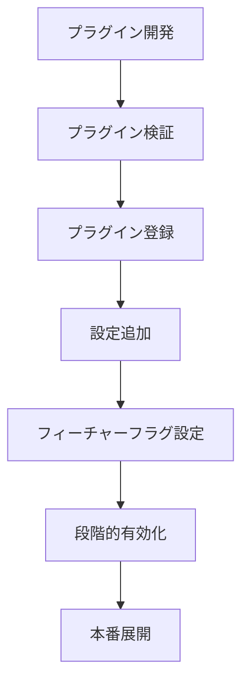

# プラグイン型拡張フレームワーク基本設計書

## 1. 概要

本設計書は、Conea統合システムに新規APIを動的に追加可能なプラグイン型拡張フレームワークの基本設計を定義します。既存システムへの影響を最小限に抑えながら、柔軟な機能拡張を実現します。

## 2. 設計原則

### 2.1 基本コンセプト
- **Zero Impact**: 既存システムへの影響ゼロ
- **Hot Pluggable**: サービス再起動不要での追加・削除
- **Isolation**: プラグイン間の完全な分離
- **Feature Flags**: 段階的な有効化制御

### 2.2 アーキテクチャ原則
- **依存性逆転**: コアシステムはプラグインに依存しない
- **開放閉鎖原則**: 拡張に対して開き、修正に対して閉じる
- **単一責任原則**: 各プラグインは単一のAPIサービスに責任を持つ

## 3. システムアーキテクチャ

### 3.1 コンポーネント構成

```
┌─────────────────────────────────────────────────────────┐
│                   Core System                            │
├─────────────────────────────────────────────────────────┤
│  ┌──────────────┐  ┌──────────────┐  ┌──────────────┐ │
│  │Plugin Manager│  │Plugin Loader │  │Plugin Registry│ │
│  └──────────────┘  └──────────────┘  └──────────────┘ │
├─────────────────────────────────────────────────────────┤
│                Plugin Interface Layer                    │
├─────────────────────────────────────────────────────────┤
│  ┌──────────┐  ┌──────────┐  ┌──────────┐            │
│  │Plugin A  │  │Plugin B  │  │Plugin C  │  ...        │
│  │(Shopify) │  │(Smaregi) │  │(Weather) │            │
│  └──────────┘  └──────────┘  └──────────┘            │
└─────────────────────────────────────────────────────────┘
```

### 3.2 プラグインライフサイクル

```typescript
enum PluginState {
  UNLOADED = 'unloaded',
  LOADING = 'loading',
  LOADED = 'loaded',
  ACTIVE = 'active',
  INACTIVE = 'inactive',
  ERROR = 'error',
  UNLOADING = 'unloading'
}

interface PluginLifecycle {
  // プラグインの読み込み
  load(): Promise<void>;
  
  // プラグインの初期化
  initialize(context: PluginContext): Promise<void>;
  
  // プラグインの有効化
  activate(): Promise<void>;
  
  // プラグインの無効化
  deactivate(): Promise<void>;
  
  // プラグインのアンロード
  unload(): Promise<void>;
}
```

## 4. プラグインインターフェース定義

### 4.1 基本インターフェース

```typescript
interface Plugin {
  // メタデータ
  metadata: PluginMetadata;
  
  // ライフサイクルメソッド
  lifecycle: PluginLifecycle;
  
  // APIサービス実装
  service: APIService;
  
  // 設定スキーマ
  configSchema: object;
  
  // 依存関係
  dependencies?: PluginDependency[];
}

interface PluginMetadata {
  id: string;
  name: string;
  version: string;
  description: string;
  author: string;
  license: string;
  category: 'ec' | 'pos' | 'analytics' | 'utility' | 'custom';
  tags: string[];
  homepage?: string;
  repository?: string;
}
```

### 4.2 プラグインコンテキスト

```typescript
interface PluginContext {
  // ロガー
  logger: Logger;
  
  // 設定アクセス
  config: ConfigManager;
  
  // イベントバス
  events: EventEmitter;
  
  // 共有ストレージ
  storage: StorageAdapter;
  
  // メトリクス
  metrics: MetricsCollector;
  
  // フィーチャーフラグ
  features: FeatureFlags;
}
```

## 5. プラグイン追加手順

### 5.1 標準追加フロー



### 5.2 ディレクトリ構造

```
plugins/
├── @official/                 # 公式プラグイン
│   ├── shopify-api/
│   │   ├── package.json
│   │   ├── plugin.yaml       # プラグイン定義
│   │   ├── src/
│   │   ├── tests/
│   │   └── README.md
│   └── smaregi-pos/
├── @community/               # コミュニティプラグイン
└── @custom/                  # カスタムプラグイン
```

### 5.3 プラグイン定義ファイル

```yaml
# plugin.yaml
plugin:
  id: shopify-api
  name: Shopify API Plugin
  version: 1.0.0
  description: Shopify EC統合プラグイン
  author: Conea Team
  license: MIT
  category: ec
  tags:
    - ecommerce
    - shopify
    - api

runtime:
  engine: node
  version: ">=18.0.0"

dependencies:
  - id: core-api
    version: "^2.0.0"

permissions:
  - network: allow
  - filesystem: read
  - environment: 
    - SHOPIFY_API_KEY
    - SHOPIFY_API_SECRET

exports:
  service: ./dist/service.js
  config: ./schemas/config.schema.json
```

## 6. 分離アーキテクチャ

### 6.1 プロセス分離

```typescript
class PluginIsolation {
  // Worker Threadでの実行
  private async runInWorker(plugin: Plugin, method: string, args: any[]): Promise<any> {
    const worker = new Worker('./plugin-worker.js', {
      workerData: {
        pluginPath: plugin.path,
        method,
        args
      }
    });
    
    return new Promise((resolve, reject) => {
      worker.on('message', resolve);
      worker.on('error', reject);
      worker.on('exit', (code) => {
        if (code !== 0) {
          reject(new Error(`Worker stopped with exit code ${code}`));
        }
      });
    });
  }
}
```

### 6.2 リソース制限

```typescript
interface PluginResourceLimits {
  // CPU制限
  cpu: {
    maxUsage: number;      // パーセンテージ
    throttling: boolean;
  };
  
  // メモリ制限
  memory: {
    maxHeapSize: number;   // MB
    maxRss: number;        // MB
  };
  
  // ネットワーク制限
  network: {
    maxBandwidth: number;  // KB/s
    maxConnections: number;
  };
  
  // 実行時間制限
  execution: {
    maxDuration: number;   // ミリ秒
    timeout: number;       // ミリ秒
  };
}
```

## 7. フィーチャーフラグ実装

### 7.1 フラグ管理

```typescript
interface FeatureFlag {
  id: string;
  name: string;
  description: string;
  enabled: boolean;
  rollout: RolloutStrategy;
  conditions?: FlagCondition[];
}

interface RolloutStrategy {
  type: 'all' | 'percentage' | 'user_list' | 'gradual';
  value: any;
  schedule?: {
    start: Date;
    end: Date;
    steps: RolloutStep[];
  };
}
```

### 7.2 段階的有効化

```typescript
class GradualRollout {
  async enableForPercentage(plugin: Plugin, percentage: number): Promise<void> {
    const flag = await this.getFeatureFlag(plugin.metadata.id);
    
    flag.rollout = {
      type: 'percentage',
      value: percentage
    };
    
    await this.updateFeatureFlag(flag);
    await this.notifyPluginManager(plugin, flag);
  }
  
  async enableForUsers(plugin: Plugin, userIds: string[]): Promise<void> {
    const flag = await this.getFeatureFlag(plugin.metadata.id);
    
    flag.rollout = {
      type: 'user_list',
      value: userIds
    };
    
    await this.updateFeatureFlag(flag);
  }
}
```

## 8. ホットプラグ実装

### 8.1 動的ロード

```typescript
class HotPlugManager {
  private plugins: Map<string, Plugin> = new Map();
  private watcher: FSWatcher;
  
  async enableHotReload(): Promise<void> {
    this.watcher = watch('./plugins', {
      recursive: true,
      persistent: true
    });
    
    this.watcher.on('change', async (eventType, filename) => {
      if (filename?.endsWith('plugin.yaml')) {
        await this.reloadPlugin(filename);
      }
    });
  }
  
  private async reloadPlugin(configPath: string): Promise<void> {
    const pluginId = this.extractPluginId(configPath);
    const existingPlugin = this.plugins.get(pluginId);
    
    if (existingPlugin) {
      // 既存接続を維持しながら更新
      await this.gracefulReload(existingPlugin);
    } else {
      // 新規プラグインとして追加
      await this.loadNewPlugin(configPath);
    }
  }
  
  private async gracefulReload(plugin: Plugin): Promise<void> {
    // 新しいインスタンスを準備
    const newPlugin = await this.prepareNewInstance(plugin);
    
    // トラフィックを段階的に切り替え
    await this.switchTraffic(plugin, newPlugin);
    
    // 古いインスタンスを破棄
    await plugin.lifecycle.unload();
    
    // レジストリを更新
    this.plugins.set(plugin.metadata.id, newPlugin);
  }
}
```

### 8.2 ゼロダウンタイム更新

```typescript
class ZeroDowntimeUpdater {
  async updatePlugin(pluginId: string, newVersion: string): Promise<void> {
    // 1. 新バージョンをバックグラウンドでロード
    const newPlugin = await this.loadPluginVersion(pluginId, newVersion);
    
    // 2. ヘルスチェック
    const health = await newPlugin.service.healthCheck();
    if (health.status !== 'healthy') {
      throw new Error('New plugin version health check failed');
    }
    
    // 3. カナリアデプロイメント
    await this.canaryDeploy(pluginId, newPlugin, {
      initialPercentage: 10,
      incrementPercentage: 20,
      intervalMinutes: 5,
      errorThreshold: 0.01
    });
    
    // 4. 完全切り替え
    await this.completeSwitch(pluginId, newPlugin);
  }
}
```

## 9. セキュリティ考慮事項

### 9.1 サンドボックス実行

```typescript
interface PluginSandbox {
  // 許可されたAPI
  allowedAPIs: string[];
  
  // ファイルシステムアクセス
  filesystem: {
    readPaths: string[];
    writePaths: string[];
  };
  
  // ネットワークアクセス
  network: {
    allowedHosts: string[];
    blockedPorts: number[];
  };
  
  // 環境変数アクセス
  environment: {
    allowedVars: string[];
  };
}
```

### 9.2 プラグイン検証

```typescript
class PluginValidator {
  async validate(pluginPath: string): Promise<ValidationResult> {
    const checks = [
      this.checkSignature,
      this.checkDependencies,
      this.checkPermissions,
      this.checkCodeQuality,
      this.checkSecurity
    ];
    
    const results = await Promise.all(
      checks.map(check => check(pluginPath))
    );
    
    return {
      valid: results.every(r => r.valid),
      errors: results.flatMap(r => r.errors || [])
    };
  }
}
```

## 10. 実装例

### 10.1 プラグイン実装例

```typescript
// plugins/@official/shopify-api/src/index.ts
import { Plugin, APIService, PluginContext } from '@conea/plugin-sdk';

export class ShopifyPlugin implements Plugin {
  metadata = {
    id: 'shopify-api',
    name: 'Shopify API Plugin',
    version: '1.0.0',
    description: 'Shopify EC統合プラグイン',
    author: 'Conea Team',
    license: 'MIT',
    category: 'ec' as const,
    tags: ['ecommerce', 'shopify']
  };
  
  private context: PluginContext;
  private service: ShopifyAPIService;
  
  lifecycle = {
    async load(): Promise<void> {
      // リソースの準備
    },
    
    async initialize(context: PluginContext): Promise<void> {
      this.context = context;
      this.service = new ShopifyAPIService(context);
    },
    
    async activate(): Promise<void> {
      await this.service.init(this.context.config.get('shopify'));
      this.context.logger.info('Shopify plugin activated');
    },
    
    async deactivate(): Promise<void> {
      await this.service.dispose();
    },
    
    async unload(): Promise<void> {
      // リソースの解放
    }
  };
  
  get service(): APIService {
    return this.service;
  }
  
  configSchema = {
    // JSON Schema定義
  };
}
```

### 10.2 プラグイン登録例

```typescript
// プラグインマネージャーでの登録
const pluginManager = new PluginManager();

// プラグインの追加
await pluginManager.register({
  path: './plugins/@official/shopify-api',
  options: {
    autoActivate: false,
    featureFlag: 'shopify_integration'
  }
});

// フィーチャーフラグによる有効化
await pluginManager.enableFeature('shopify_integration', {
  rollout: {
    type: 'gradual',
    schedule: {
      start: new Date('2024-01-01'),
      end: new Date('2024-01-07'),
      steps: [
        { percentage: 10, date: '2024-01-01' },
        { percentage: 25, date: '2024-01-03' },
        { percentage: 50, date: '2024-01-05' },
        { percentage: 100, date: '2024-01-07' }
      ]
    }
  }
});
```

## 11. 今後の拡張計画

### 11.1 高度な機能
- プラグイン間通信メカニズム
- 分散プラグイン実行
- プラグインマーケットプレイス
- 自動更新機能

### 11.2 開発者エクスペリエンス
- プラグイン開発用CLI
- テンプレート生成
- デバッグツール
- パフォーマンスプロファイラー

### 11.3 エンタープライズ機能
- プラグイン承認ワークフロー
- 監査ログ
- コンプライアンス対応
- SLA管理