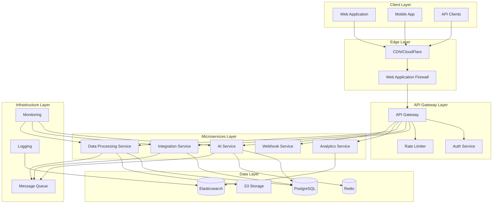
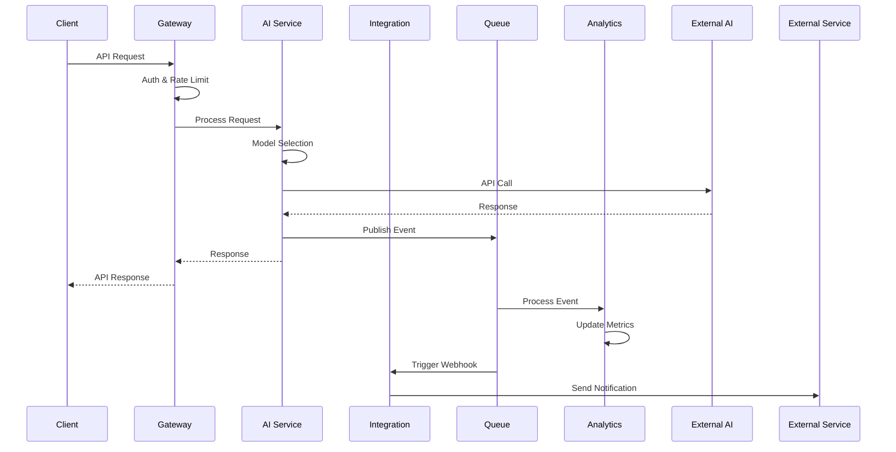
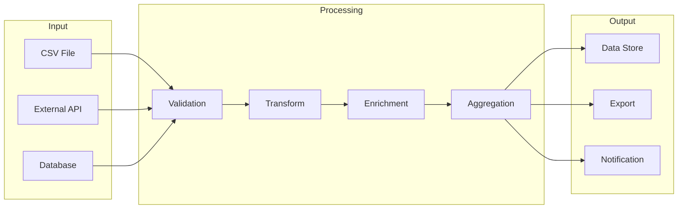
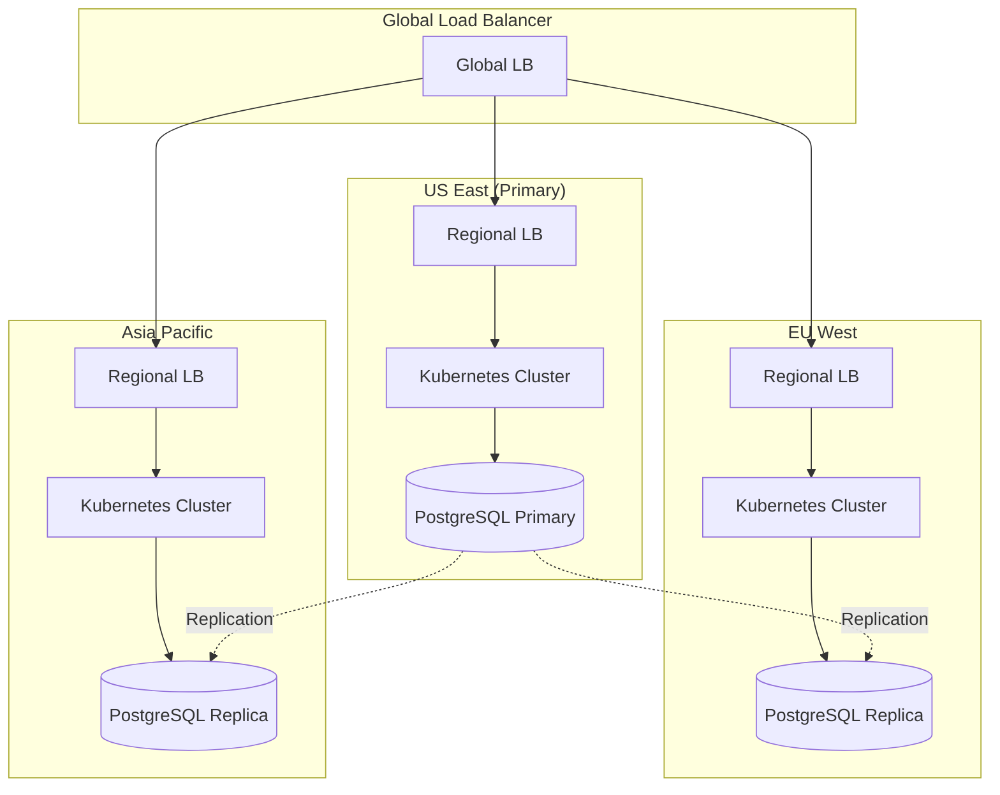

# Conea Integration Platform - システム設計書

## 目次

1. [概要](#概要)
2. [システムアーキテクチャ](#システムアーキテクチャ)
3. [コンポーネント設計](#コンポーネント設計)
4. [データフロー](#データフロー)
5. [セキュリティ設計](#セキュリティ設計)
6. [スケーラビリティ設計](#スケーラビリティ設計)
7. [技術スタック](#技術スタック)
8. [デプロイメントアーキテクチャ](#デプロイメントアーキテクチャ)

## 概要

Conea Integration Platformは、マイクロサービスアーキテクチャを採用した、エンタープライズグレードのAI統合プラットフォームです。本設計書では、システムの技術的な設計と実装の詳細について説明します。

### 設計原則

1. **マイクロサービス**: 各機能を独立したサービスとして実装
2. **API First**: すべての機能をAPIとして公開
3. **イベント駆動**: 非同期処理とリアルタイム更新
4. **セキュリティ by Design**: 設計段階からセキュリティを考慮
5. **高可用性**: 99.9% SLAを目標

## システムアーキテクチャ

### ハイレベルアーキテクチャ



### レイヤー別責務

#### 1. Client Layer
- **Web Application**: React/Next.jsベースのSPA
- **Mobile App**: React Native（将来実装）
- **API Clients**: SDK、CLIツール

#### 2. Edge Layer
- **CDN**: 静的コンテンツ配信、DDoS保護
- **WAF**: セキュリティフィルタリング、攻撃防御

#### 3. API Gateway Layer
- **API Gateway**: ルーティング、認証、レート制限
- **Auth Service**: OAuth2.0、JWT管理
- **Rate Limiter**: API使用量制御

#### 4. Microservices Layer
- **AI Service**: AIモデル統合、推論処理
- **Integration Service**: 外部API連携
- **Data Processing Service**: ETL、バッチ処理
- **Analytics Service**: データ分析、レポート生成
- **Webhook Service**: イベント配信

#### 5. Data Layer
- **PostgreSQL**: トランザクショナルデータ
- **Redis**: キャッシュ、セッション管理
- **S3**: ファイルストレージ
- **Elasticsearch**: ログ、全文検索

## コンポーネント設計

### AI Service

```typescript
// AI Service アーキテクチャ
interface AIService {
  // モデル管理
  models: {
    register(model: AIModel): Promise<void>;
    list(): Promise<AIModel[]>;
    get(id: string): Promise<AIModel>;
  };
  
  // 推論実行
  inference: {
    chat(request: ChatRequest): Promise<ChatResponse>;
    completion(request: CompletionRequest): Promise<CompletionResponse>;
    embedding(request: EmbeddingRequest): Promise<EmbeddingResponse>;
  };
  
  // ロードバランシング
  loadBalancer: {
    selectModel(requirements: ModelRequirements): AIModel;
    updateMetrics(modelId: string, metrics: UsageMetrics): void;
  };
}
```

#### 主要機能

1. **モデル抽象化層**
   - 複数のAIプロバイダーを統一インターフェースで管理
   - プロバイダー固有の実装を隠蔽

2. **インテリジェントルーティング**
   - コスト、レイテンシ、精度に基づく最適なモデル選択
   - フォールバック機構

3. **レスポンスキャッシング**
   - 同一リクエストの結果をキャッシュ
   - TTLベースの自動削除

### Integration Service

```typescript
// Integration Service アーキテクチャ
interface IntegrationService {
  // コネクター管理
  connectors: {
    shopify: ShopifyConnector;
    amazon: AmazonConnector;
    rakuten: RakutenConnector;
    slack: SlackConnector;
  };
  
  // データ同期
  sync: {
    schedule(integration: Integration, interval: CronExpression): void;
    execute(integrationId: string): Promise<SyncResult>;
    status(jobId: string): Promise<JobStatus>;
  };
  
  // Webhook処理
  webhooks: {
    register(webhook: WebhookConfig): Promise<string>;
    process(event: WebhookEvent): Promise<void>;
    verify(signature: string, payload: any): boolean;
  };
}
```

#### 統合パターン

1. **ポーリング方式**
   - 定期的にデータを取得
   - 変更検知とデルタ同期

2. **Webhook方式**
   - リアルタイムイベント受信
   - 署名検証とリトライ処理

3. **ハイブリッド方式**
   - Webhookとポーリングの組み合わせ
   - 高信頼性の保証

### Data Processing Service

```typescript
// Data Processing Service アーキテクチャ
interface DataProcessingService {
  // ETLパイプライン
  pipeline: {
    create(config: PipelineConfig): Pipeline;
    execute(pipelineId: string, data: any): Promise<ProcessedData>;
    monitor(pipelineId: string): PipelineMetrics;
  };
  
  // データ変換
  transform: {
    map(data: any, mapping: FieldMapping): any;
    validate(data: any, schema: ValidationSchema): ValidationResult;
    enrich(data: any, enrichments: Enrichment[]): Promise<any>;
  };
  
  // バッチ処理
  batch: {
    create(job: BatchJob): Promise<string>;
    status(jobId: string): Promise<BatchJobStatus>;
    results(jobId: string): AsyncIterator<BatchResult>;
  };
}
```

## データフロー

### リアルタイムデータフロー



### バッチ処理フロー



## セキュリティ設計

### 認証・認可

```yaml
# セキュリティポリシー定義
security:
  authentication:
    methods:
      - jwt:
          algorithm: RS256
          expiry: 3600
          refresh_expiry: 2592000
      - oauth2:
          providers:
            - google
            - github
          scopes:
            - read:profile
            - write:data
      - api_key:
          header: X-API-Key
          rotation: 90d
  
  authorization:
    rbac:
      roles:
        - admin:
            permissions: ["*"]
        - user:
            permissions: 
              - "read:own_data"
              - "write:own_data"
              - "execute:ai_requests"
        - viewer:
            permissions: ["read:own_data"]
    
    policies:
      - name: rate_limit
        rules:
          - role: user
            limit: 1000/hour
          - role: admin
            limit: unlimited
```

### データ暗号化

1. **転送中の暗号化**
   - TLS 1.3必須
   - HSTS有効化
   - 証明書ピンニング

2. **保存時の暗号化**
   - AES-256-GCM
   - フィールドレベル暗号化
   - キーローテーション

3. **シークレット管理**
   - AWS Secrets Manager / HashiCorp Vault
   - 環境変数の暗号化
   - 最小権限の原則

### 監査とコンプライアンス

```typescript
// 監査ログシステム
interface AuditSystem {
  // イベント記録
  log(event: AuditEvent): Promise<void>;
  
  // 検索とレポート
  search(criteria: SearchCriteria): Promise<AuditLog[]>;
  report(period: DateRange): Promise<ComplianceReport>;
  
  // 保持とアーカイブ
  retention: {
    policy: RetentionPolicy;
    archive(before: Date): Promise<void>;
    purge(criteria: PurgeCriteria): Promise<void>;
  };
}

interface AuditEvent {
  timestamp: Date;
  userId: string;
  action: string;
  resource: string;
  result: 'success' | 'failure';
  metadata: Record<string, any>;
  ipAddress: string;
  userAgent: string;
}
```

## スケーラビリティ設計

### 水平スケーリング戦略

```yaml
# Kubernetes Horizontal Pod Autoscaler
apiVersion: autoscaling/v2
kind: HorizontalPodAutoscaler
metadata:
  name: ai-service-hpa
spec:
  scaleTargetRef:
    apiVersion: apps/v1
    kind: Deployment
    name: ai-service
  minReplicas: 3
  maxReplicas: 100
  metrics:
  - type: Resource
    resource:
      name: cpu
      target:
        type: Utilization
        averageUtilization: 70
  - type: Resource
    resource:
      name: memory
      target:
        type: Utilization
        averageUtilization: 80
  - type: Pods
    pods:
      metric:
        name: http_requests_per_second
      target:
        type: AverageValue
        averageValue: "1000"
```

### キャッシング戦略

```typescript
// 多層キャッシングアーキテクチャ
class CacheStrategy {
  // L1: アプリケーションメモリキャッシュ
  private l1Cache = new LRUCache<string, any>({
    max: 1000,
    ttl: 60 * 1000 // 1分
  });
  
  // L2: Redis分散キャッシュ
  private l2Cache = new RedisCache({
    ttl: 3600, // 1時間
    namespace: 'conea'
  });
  
  // L3: CDNエッジキャッシュ
  private l3Cache = new CDNCache({
    ttl: 86400, // 24時間
    regions: ['us-east', 'eu-west', 'ap-northeast']
  });
  
  async get(key: string): Promise<any> {
    // L1チェック
    let value = this.l1Cache.get(key);
    if (value) return value;
    
    // L2チェック
    value = await this.l2Cache.get(key);
    if (value) {
      this.l1Cache.set(key, value);
      return value;
    }
    
    // L3チェック
    value = await this.l3Cache.get(key);
    if (value) {
      await this.l2Cache.set(key, value);
      this.l1Cache.set(key, value);
      return value;
    }
    
    return null;
  }
}
```

### データベース最適化

1. **読み取りレプリカ**
   - マスター/スレーブ構成
   - 地理的分散
   - 自動フェイルオーバー

2. **パーティショニング**
   - 時系列データの月次パーティション
   - ユーザーIDによるシャーディング
   - ホットデータの分離

3. **インデックス戦略**
   ```sql
   -- 複合インデックス
   CREATE INDEX idx_user_created ON transactions(user_id, created_at);
   
   -- 部分インデックス
   CREATE INDEX idx_active_products ON products(id) 
   WHERE status = 'active';
   
   -- JSONBインデックス
   CREATE INDEX idx_metadata ON events USING gin(metadata);
   ```

## 技術スタック

### バックエンド

| カテゴリ | 技術 | バージョン | 用途 |
|---------|------|-----------|------|
| Runtime | Node.js | 18.x | サーバーサイドJavaScript実行環境 |
| Framework | Express | 4.x | Web APIフレームワーク |
| GraphQL | Apollo Server | 4.x | GraphQLサーバー |
| Database | PostgreSQL | 14.x | プライマリデータベース |
| Cache | Redis | 6.x | キャッシュ、セッション管理 |
| Queue | Bull | 4.x | ジョブキュー |
| Search | Elasticsearch | 8.x | 全文検索、ログ分析 |

### フロントエンド

| カテゴリ | 技術 | バージョン | 用途 |
|---------|------|-----------|------|
| Framework | React | 18.x | UIライブラリ |
| Meta Framework | Next.js | 14.x | SSR/SSGフレームワーク |
| Language | TypeScript | 5.x | 型安全なJavaScript |
| State | Redux Toolkit | 2.x | 状態管理 |
| UI Library | Material-UI | 5.x | UIコンポーネント |
| GraphQL Client | Apollo Client | 3.x | GraphQLクライアント |

### インフラストラクチャ

| カテゴリ | 技術 | 用途 |
|---------|------|------|
| Container | Docker | コンテナ化 |
| Orchestration | Kubernetes | コンテナオーケストレーション |
| Service Mesh | Istio | マイクロサービス管理 |
| CI/CD | GitHub Actions | 継続的統合/デプロイ |
| Monitoring | Prometheus + Grafana | メトリクス監視 |
| Logging | ELK Stack | ログ収集・分析 |
| Tracing | Jaeger | 分散トレーシング |

## デプロイメントアーキテクチャ

### Kubernetes構成

```yaml
# Production Namespace構成
apiVersion: v1
kind: Namespace
metadata:
  name: conea-production
  labels:
    environment: production
    
---
# AI Service Deployment
apiVersion: apps/v1
kind: Deployment
metadata:
  name: ai-service
  namespace: conea-production
spec:
  replicas: 5
  selector:
    matchLabels:
      app: ai-service
  template:
    metadata:
      labels:
        app: ai-service
    spec:
      containers:
      - name: ai-service
        image: conea/ai-service:1.0.0
        ports:
        - containerPort: 3000
        env:
        - name: NODE_ENV
          value: "production"
        resources:
          requests:
            memory: "512Mi"
            cpu: "500m"
          limits:
            memory: "2Gi"
            cpu: "2000m"
        livenessProbe:
          httpGet:
            path: /health
            port: 3000
          initialDelaySeconds: 30
          periodSeconds: 10
        readinessProbe:
          httpGet:
            path: /ready
            port: 3000
          initialDelaySeconds: 5
          periodSeconds: 5
```

### マルチリージョン展開



### 災害復旧計画

1. **RPO (Recovery Point Objective)**: 5分
2. **RTO (Recovery Time Objective)**: 30分
3. **バックアップ戦略**:
   - 継続的レプリケーション
   - 日次スナップショット
   - 地理的に分散した3箇所保存

---

最終更新日: 2025年5月26日